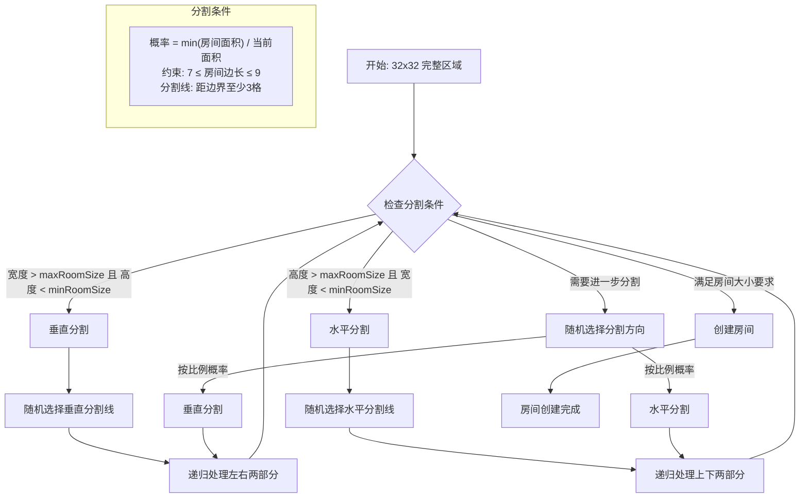
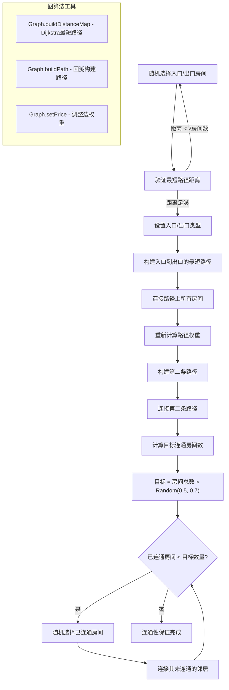
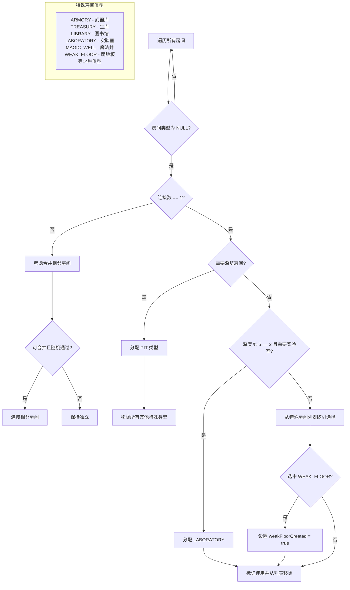
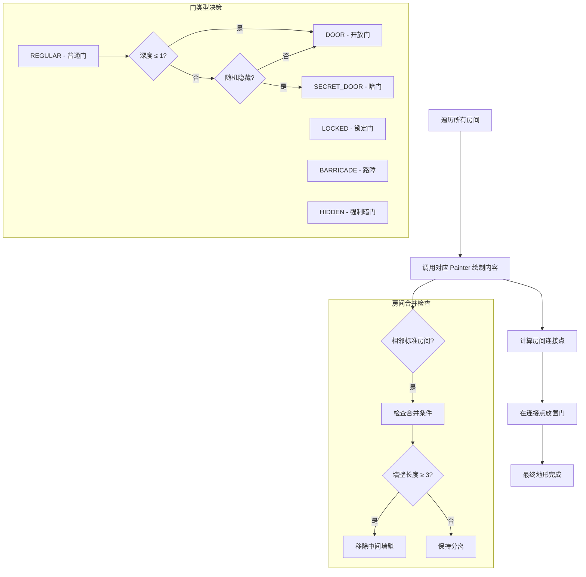

# 地牢生成算法详解

该文档深入分析 Pixel Dungeon 中基于 BSP（Binary Space Partitioning）的随机地牢生成算法，涵盖房间分割、连通性保证、特殊房间分配等核心机制。

## 算法概览

Pixel Dungeon 采用 **BSP 树递归分割 + 图连通性算法** 生成地牢：

1. **空间分割**：递归地将 32×32 地图分割成大小合适的矩形房间
2. **邻接计算**：构建房间邻接图，为后续连通做准备
3. **路径规划**：确保入口到出口存在路径，并连接额外房间
4. **房间分类**：分配特殊房间类型（商店、宝库、陷阱房等）
5. **地形绘制**：根据房间类型和连接关系绘制最终地形

## 核心算法详解

### 1. BSP 递归分割算法



**关键代码逻辑**：

```java
protected void split(Rect rect) {
    int w = rect.width();
    int h = rect.height();
    
    // 强制分割条件：一边过长且另一边过短
    if (w > maxRoomSize && h < minRoomSize) {
        // 垂直分割
        int vw = Random.Int(rect.left + 3, rect.right - 3);
        split(new Rect(rect.left, rect.top, vw, rect.bottom));
        split(new Rect(vw, rect.top, rect.right, rect.bottom));
    } 
    // 停止分割条件：满足大小要求或已经过小
    else if (satisfiesRoomSize(rect) || tooSmallToDivide(rect)) {
        rooms.add(new Room().set(rect));
    } 
    // 随机分割：按边长比例决定方向
    else {
        if (Random.Float() < (float)(w - 2) / (w + h - 4)) {
            verticalSplit(rect);
        } else {
            horizontalSplit(rect);
        }
    }
}
```

**分割策略**：

- **房间大小约束**：`minRoomSize = 7`, `maxRoomSize = 9`
- **分割线约束**：距离边界至少 3 格，确保连接空间
- **概率分割**：按 `(宽度-2) / (总周长-4)` 比例选择垂直分割
- **终止条件**：房间面积概率或尺寸达标时停止

### 2. 邻接关系构建

分割完成后，算法计算所有房间对的邻接关系：

```java
// 为每对房间计算邻接关系
for (int i = 0; i < rooms.length - 1; i++) {
    for (int j = i + 1; j < rooms.length; j++) {
        rooms[i].addNeigbour(rooms[j]);
    }
}

// 邻接判定：交集是3格以上的直线
public void addNeigbour(Room other) {
    Rect intersection = intersect(other);
    if ((intersection.width() == 0 && intersection.height() >= 3) || 
        (intersection.height() == 0 && intersection.width() >= 3)) {
        neighbours.add(other);
        other.neighbours.add(this);
    }
}
```

### 3. 连通性保证算法



**连通策略**：

1. **主路径**：入口到出口的最短路径，保证基本通关
2. **次路径**：调整权重后的第二条路径，增加路径多样性
3. **扩展连接**：随机连接 50%-70% 的房间，平衡探索性与复杂度

### 4. 特殊房间分配算法



**分配规则**：

- **深坑房间**：优先级最高，出现时移除其他特殊类型可能
- **实验室**：固定在深度 % 5 == 2 的楼层
- **弱地板**：影响下一层生成，需要特殊标记
- **概率控制**：`Random.Int(specialRooms² + 2) == 0`，已有特殊房间越多，新增概率越低

### 5. 地形绘制与门生成



**绘制顺序**：

1. **房间内容**：根据房间类型调用对应 `Painter`
2. **连接计算**：在房间交集处确定门的位置
3. **门类型**：根据深度、随机性决定门的类型
4. **房间合并**：符合条件的相邻标准房间可移除中间墙壁

## 算法参数与平衡

### 房间尺寸控制

- **最小房间**: 7×7 格，保证内容放置空间
- **最大房间**: 9×9 格，避免过大的空旷感
- **分割边距**: 3 格，确保门和通道的放置空间

### 连通性参数

- **最小路径距离**: `√房间数`，避免入口出口过近
- **连通房间比例**: 50%-70%，平衡探索性和复杂度
- **重试次数**: 最多 10 次，防止无限循环

### 特殊房间控制

- **概率递减**: `1/(已有特殊房间数² + 2)`
- **类型洗牌**: 每次游戏开始时打乱特殊房间顺序
- **深度约束**: 特定房间只在特定深度出现

## 算法优势与特点

### 1. 保证性质

- **连通性**: 图算法确保入口到出口必达
- **合理性**: BSP 分割避免过大或过小房间
- **可探索性**: 额外连接增加探索路径

### 2. 随机性平衡

- **结构随机**: BSP 分割点随机选择
- **路径随机**: 多条路径连接方式
- **内容随机**: 特殊房间类型和位置

### 3. 性能考虑

- **递归深度有限**: 房间尺寸约束限制分割次数
- **图算法高效**: Dijkstra 和回溯路径构建
- **重试机制**: 防止生成失败的无限循环

## 扩展与变体

不同楼层通过继承 `RegularLevel` 实现变体：

- **SewerLevel**: 增加水域和草地特效
- **PrisonLevel**: 调整房间密度和陷阱概率
- **CityLevel**: 更大房间和特殊布局
- **HallsLevel**: 复杂连接和高级陷阱

每个变体重写 `water()`, `grass()`, `nTraps()` 等方法，在统一算法框架下实现不同风格的地牢生成。
