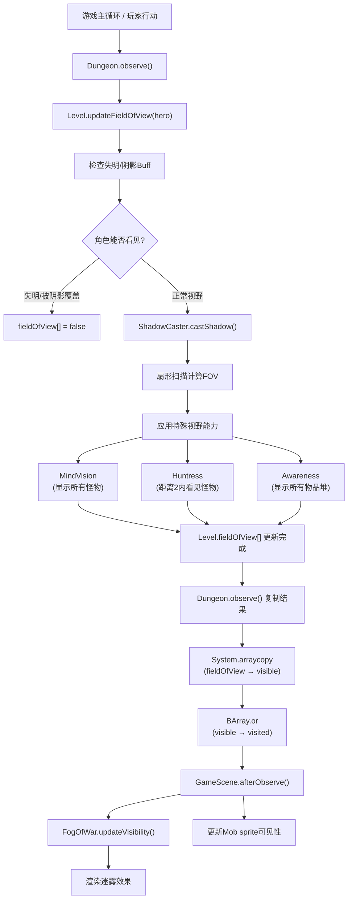
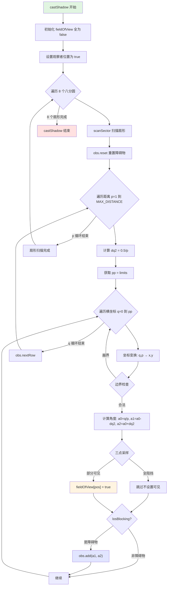
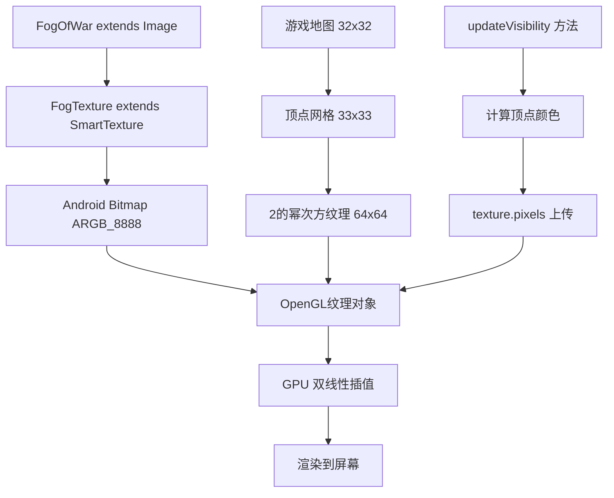
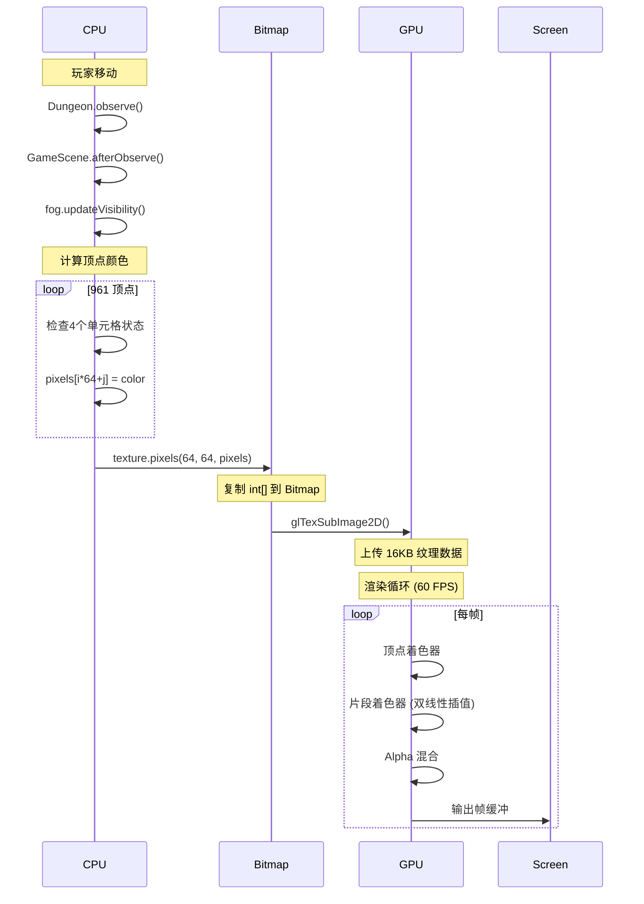
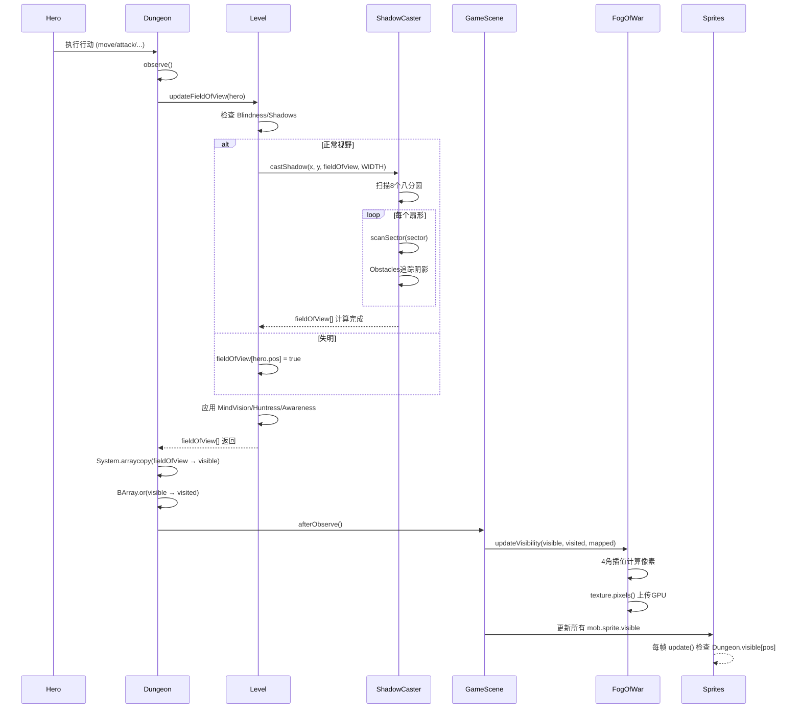

# 视野与可见性系统

## 概述

Pixel Dungeon 实现了一个完整的视野系统（Field of View, FOV），根据玩家位置和环境障碍物动态计算可见区域。该系统影响怪物AI、物品显示、地图渲染等多个游戏层面。

## 系统架构

视野系统由三个核心组件构成：



## 1. ShadowCaster 算法深度解析

### 1.1 算法概述

`ShadowCaster` 实现了经典的 **扇形投射视野算法**（Sector-based Shadow Casting），这是 Roguelike 游戏中最精确的 FOV 算法之一。

**核心思想：**

- 将视野划分为 **8 个八分圆**（octant），每个八分圆使用不同的坐标变换
- 从观察者位置向外 **逐行扫描**，追踪遮挡物产生的 **角度阴影**
- 使用 **三点采样** 判断单元格是否被完全阻挡

**关键特性：**

- **最大视距**: `MAX_DISTANCE = 8` 个单元格
- **预计算表**: `rounding[][]` 二维数组存储圆形边界
- **角度区间**: 使用浮点数精确追踪阴影扇形
- **逐行合并**: 相邻障碍物自动合并为连续阴影

### 1.2 静态初始化与预计算

#### 1.2.1 预计算圆形边界表

```java
private static int[][] rounding;
static {
    rounding = new int[MAX_DISTANCE+1][];  // 9 行 (距离 0-8)
    
    for (int i=1; i <= MAX_DISTANCE; i++) {
        rounding[i] = new int[i+1];  // 每行长度递增
        
        for (int j=1; j <= i; j++) {
            // 使用反正弦函数计算圆形边界
            rounding[i][j] = (int)Math.min( j, 
                Math.round( i * Math.cos( Math.asin( j / (i + 0.5) ))));
        }
    }
}
```

**数学原理：**

``` text
在半径为 r 的圆上，给定 y 坐标，计算 x 坐标:

圆方程: x² + y² = r²
解得:   x = √(r² - y²)

代码使用三角函数等价形式:
1. sin(θ) = y / (r + 0.5)     [+0.5 用于反走样]
2. θ = asin(y / (r + 0.5))
3. x = r * cos(θ)
```

**预计算表示例 (MAX_DISTANCE = 8):**

| 距离 i | j=1 | j=2 | j=3 | j=4 | j=5 | j=6 | j=7 | j=8 |
|--------|-----|-----|-----|-----|-----|-----|-----|-----|
| 1 | 1 | - | - | - | - | - | - | - |
| 2 | 2 | 1 | - | - | - | - | - | - |
| 3 | 3 | 3 | 2 | - | - | - | - | - |
| 4 | 4 | 4 | 3 | 2 | - | - | - | - |
| 5 | 5 | 5 | 4 | 4 | 3 | - | - | - |
| 6 | 6 | 6 | 5 | 5 | 4 | 3 | - | - |
| 7 | 7 | 7 | 6 | 6 | 5 | 5 | 4 | - |
| 8 | 8 | 8 | 7 | 7 | 6 | 6 | 5 | 4 |

**解读:** `rounding[5][3] = 4` 表示距离 5 时，纵坐标 3 对应的横坐标约为 4。

#### 1.2.2 八分圆坐标变换

```java
public static void castShadow( int x, int y, boolean[] fieldOfView, int distance ) {
    losBlocking = Level.losBlocking;  // 障碍物数组
    ShadowCaster.distance = distance;
    limits = rounding[distance];      // 选择对应距离的边界表
    
    ShadowCaster.fieldOfView = fieldOfView;
    Arrays.fill( fieldOfView, false );
    fieldOfView[y * WIDTH + x] = true;  // 观察者位置可见
    
    // 8 个八分圆，使用不同的坐标变换矩阵
    scanSector( x, y, +1, +1, 0, 0 );  // 第 1 象限，右上 (0°-45°)
    scanSector( x, y, -1, +1, 0, 0 );  // 第 2 象限，左上
    scanSector( x, y, +1, -1, 0, 0 );  // 第 4 象限，右下
    scanSector( x, y, -1, -1, 0, 0 );  // 第 3 象限，左下
    scanSector( x, y, 0, 0, +1, +1 );  // 第 1 象限，右上 (45°-90°)
    scanSector( x, y, 0, 0, -1, +1 );  // 第 2 象限，左上
    scanSector( x, y, 0, 0, +1, -1 );  // 第 4 象限，右下
    scanSector( x, y, 0, 0, -1, -1 );  // 第 3 象限，左下
}
```

**坐标变换矩阵:**

| 八分圆 | m1 | m2 | m3 | m4 | 角度范围 | 说明 |
|--------|----|----|----|----|---------|------|
| 1 | +1 | +1 | 0 | 0 | 0°-45° | 右上，x 主轴 |
| 2 | 0 | 0 | +1 | +1 | 45°-90° | 右上，y 主轴 |
| 3 | 0 | 0 | -1 | +1 | 90°-135° | 左上，y 主轴 |
| 4 | -1 | +1 | 0 | 0 | 135°-180° | 左上，x 主轴 |
| 5 | -1 | -1 | 0 | 0 | 180°-225° | 左下，x 主轴 |
| 6 | 0 | 0 | -1 | -1 | 225°-270° | 左下，y 主轴 |
| 7 | 0 | 0 | +1 | -1 | 270°-315° | 右下，y 主轴 |
| 8 | +1 | -1 | 0 | 0 | 315°-360° | 右下，x 主轴 |

### 1.3 扇形扫描核心算法

#### 1.3.1 scanSector 方法详解

```java
private static void scanSector( int cx, int cy, int m1, int m2, int m3, int m4 ) {
    
    obs.reset();  // 重置障碍物追踪器
    
    // 从距离 1 逐步扫描到最大距离
    for (int p=1; p <= distance; p++) {

        // dq2 = 单元格的半角度宽度
        float dq2 = 0.5f / p;
        
        // pp = 当前距离下的最大横坐标
        int pp = limits[p];  // limits = rounding[distance]
        
        // 遍历当前行的所有单元格
        for (int q=0; q <= pp; q++) {
            
            // 坐标变换: (p, q) → (x, y)
            int x = cx + q * m1 + p * m3;
            int y = cy + p * m2 + q * m4;
            
            // 边界检查
            if (y >= 0 && y < HEIGHT && x >= 0 && x < WIDTH) {
                
                // 计算单元格的角度范围
                float a0 = (float)q / p;      // 中心角度
                float a1 = a0 - dq2;          // 左边界角度
                float a2 = a0 + dq2;          // 右边界角度
                
                int pos = y * WIDTH + x;
                
                // 三点采样检测: 检查中心、左边界、右边界
                if (obs.isBlocked( a0 ) && obs.isBlocked( a1 ) && obs.isBlocked( a2 )) {
                    // 完全被阻挡，跳过 (不设置可见)
                } else {
                    // 至少部分可见
                    fieldOfView[pos] = true;
                }
                
                // 如果是障碍物，添加到阴影区间
                if (losBlocking[pos]) {
                    obs.add( a1, a2 );
                }
            }
        }
        
        // 切换到下一行 (将当前行的障碍物设为生效)
        obs.nextRow();
    }
}
```

#### 1.3.2 坐标变换详解

**示例: 第 1 八分圆 (m1=+1, m2=+1, m3=0, m4=0)**

```
观察者位置: (cx=10, cy=10)
距离 p=3, 横坐标 q=2

计算:
x = cx + q * m1 + p * m3 = 10 + 2*1 + 3*0 = 12
y = cy + p * m2 + q * m4 = 10 + 3*1 + 2*0 = 13

结果: 单元格 (12, 13)
```

**可视化扫描顺序:**

```
       第 1 八分圆 (m1=+1, m2=+1, m3=0, m4=0)
       
       y
       ↑
     4 │     ●
     3 │   ● ● ●
     2 │  ● ● ● ●
     1 │ ● ● ● ● ●
     0 │ @ ─────────→ x
       0 1 2 3 4
       
 @ = 观察者
 ● = 扫描单元格
 
 扫描顺序 (p, q):
 p=1: (1,0) (1,1)
 p=2: (2,0) (2,1) (2,2)
 p=3: (3,0) (3,1) (3,2) (3,3)
 p=4: (4,0) (4,1) (4,2) (4,3) (4,4)
```

#### 1.3.3 角度计算与三点采样

**角度坐标系:**

```
        a=1.0 (45°)
           ╱│
          ╱ │
         ╱  │
        ╱   │
       ╱    │
    观察者 ──→ a=0.0 (0°)
```

**单元格角度计算:**

```java
float a0 = (float)q / p;      // 中心角度 = tan(θ) = 对边/邻边
float dq2 = 0.5f / p;         // 半角度宽度
float a1 = a0 - dq2;          // 左边界
float a2 = a0 + dq2;          // 右边界
```

**示例: p=4, q=2**

```
a0 = 2/4 = 0.5
dq2 = 0.5/4 = 0.125
a1 = 0.5 - 0.125 = 0.375
a2 = 0.5 + 0.125 = 0.625

视觉表示:
      a=0.625 ╱│
            ╱  │ ← 单元格覆盖的角度范围
      a=0.5 ╱   │
          ╱     │
    a=0.375 ─────
```

**三点采样原理:**

```java
if (obs.isBlocked( a0 ) && obs.isBlocked( a1 ) && obs.isBlocked( a2 )) {
    // 完全阻挡: 中心、左、右都被遮挡
} else {
    // 部分或完全可见
    fieldOfView[pos] = true;
}
```

**为什么需要三点？**

```
场景: 单元格部分被阴影覆盖

阴影区间: [0.4, 0.55]
单元格: a1=0.375, a0=0.5, a2=0.625

检测结果:
- isBlocked(a1=0.375) = false  (左边界在阴影外)
- isBlocked(a0=0.5)   = true   (中心在阴影内)
- isBlocked(a2=0.625) = false  (右边界在阴影外)

结论: 至少一个点可见 → 单元格可见 (部分可见也算可见)
```

### 1.4 Obstacles 类详解

#### 1.4.1 数据结构

```java
private static final class Obstacles {
    
    // 预分配最大容量: (8+1)*(8+1)/2 = 40.5 ≈ 41
    private static int SIZE = (MAX_DISTANCE+1) * (MAX_DISTANCE+1) / 2;
    private static float[] a1 = new float[SIZE];  // 左边界数组
    private static float[] a2 = new float[SIZE];  // 右边界数组
    
    private int length;  // 当前行的障碍物数量
    private int limit;   // 上一行的障碍物数量 (已生效)
    
    // ...
}
```

**为什么是三角形数 SIZE?**

```
最坏情况: 每个单元格都是障碍物，且不合并

距离 1: 最多 1 个障碍物
距离 2: 最多 2 个
距离 3: 最多 3 个
...
距离 8: 最多 8 个

总数 = 1+2+3+...+8 = 8*(8+1)/2 = 36
加上安全余量 → SIZE = 41
```

#### 1.4.2 核心方法

**reset() - 重置障碍物追踪器**

```java
public void reset() {
    length = 0;  // 当前行无障碍物
    limit = 0;   // 无生效的障碍物
}
```

**add() - 添加障碍物区间（自动合并）**

```java
public void add( float o1, float o2 ) {
    
    // 情况 1: 与上一个区间相邻或重叠 → 合并
    if (length > limit && o1 <= a2[length-1]) {
        
        // 扩展上一个区间的右边界
        a2[length-1] = o2;
        
    } else {
        // 情况 2: 独立区间 → 新增
        a1[length] = o1;
        a2[length++] = o2;
    }
}
```

**合并示例:**

```
已有区间: [0.2, 0.4]
新增区间: [0.35, 0.6]

检查: o1=0.35 <= a2[0]=0.4  → 重叠
合并: a2[0] = 0.6

结果: [0.2, 0.6]
```

**isBlocked() - 检查角度是否被阻挡**

```java
public boolean isBlocked( float a ) {
    for (int i=0; i < limit; i++) {  // 只检查已生效的障碍物
        if (a >= a1[i] && a <= a2[i]) {
            return true;  // 在某个阴影区间内
        }
    }
    return false;
}
```

**nextRow() - 切换到下一行**

```java
public void nextRow() {
    limit = length;  // 当前行的障碍物设为生效
}
```

**为什么分 `length` 和 `limit`？**

```
原因: 障碍物只阻挡更远的单元格，不阻挡同一行

示例:
距离 p=2 的障碍物:
- 在 p=2 时: 添加到 a1[], a2[]，但 limit 不变
- 在 p=3 时: nextRow() 后，limit=length，开始阻挡

时序:
p=1: length=0, limit=0  → 添加障碍物 → length=1, limit=0
p=2: nextRow() → limit=1  → p=1 的障碍物生效
     添加新障碍物 → length=2, limit=1
p=3: nextRow() → limit=2  → p=2 的障碍物生效
```

### 1.5 完整算法流程图



### 1.6 算法复杂度分析

#### 1.6.1 时间复杂度

**最坏情况 (无障碍物):**

```
单个扇形扫描的单元格数:
Σ(p=1 to 8) limits[p]

使用预计算表:
limits[1] = 1
limits[2] = 2
limits[3] = 3
...
limits[8] = 8

总数 = 1+2+3+...+8 = 36 个单元格

8 个扇形 × 36 = 288 个单元格
每个单元格: O(n) 障碍物检测，n = 已累积的障碍物数量

总时间复杂度: O(d² × n_obs)
- d = MAX_DISTANCE
- n_obs = 平均障碍物数量
```

**最好情况 (完全阻挡):**

```
如果第 1 行就完全阻挡视野:
- 只扫描 1 行
- 时间复杂度: O(1)
```

**实际复杂度:**

```
Pixel Dungeon 典型场景:
- d = 8
- n_obs ≈ 5-10 (平均每个扇形)
- 总计算量 ≈ 64 × 7.5 = 480 次比较

约 500-1000 次浮点数比较 (可接受)
```

#### 1.6.2 空间复杂度

```
静态数据:
- rounding[][] ≈ 9 × 5 × 4 bytes = 180 bytes
- Obstacles.a1/a2 = 41 × 2 × 4 bytes = 328 bytes

动态数据:
- fieldOfView[] = 1024 × 1 byte = 1 KB
- losBlocking[] = 1024 × 1 byte = 1 KB

总计 ≈ 2.5 KB (非常轻量)
```

### 1.7 算法优势与局限

#### 1.7.1 优势

1. **精确性**
   - 三点采样确保部分可见的单元格不会被遗漏
   - 障碍物合并减少冗余检测

2. **对称性**
   - 8 个八分圆完美覆盖 360°
   - 坐标变换确保各方向一致性

3. **性能**
   - 预计算表避免实时三角函数计算
   - 逐行合并减少障碍物数量

4. **可调节**
   - 可轻松修改 MAX_DISTANCE
   - 支持不同视野范围的角色

#### 1.7.2 局限

1. **固定圆形**
   - 只支持圆形视野，不支持椭圆/矩形

2. **整数网格**
   - 无法处理亚像素精度

3. **同步计算**
   - 无法并行化 (障碍物累积有顺序依赖)

4. **内存访问模式**
   - 随机访问 `losBlocking[]` 可能导致缓存未命中

### 1.8 实战应用示例

#### 1.8.1 完整视野计算示例

**场景设置:**

```
地图 (5×5):
  0 1 2 3 4
0 . . . . .
1 . @ . # .
2 . . . . .
3 . # . . .
4 . . . . .

@ = 观察者 (1, 1)
# = 障碍物 (3, 1) 和 (1, 3)
. = 空地
```

**扫描第 1 八分圆 (右上，0°-45°):**

```
p=1, q=0: (2, 2) → 可见, 非障碍物
p=1, q=1: (2, 2) → 可见, 非障碍物

p=2, q=0: (3, 3) → 可见, 非障碍物
p=2, q=1: (3, 3) → 可见, 非障碍物
p=2, q=2: (3, 3) → 可见, 非障碍物

obs.nextRow() → 无障碍物生效

p=3, q=0: (4, 4) → 可见
```

**扫描第 2 八分圆 (右上，45°-90°):**

```
p=1, q=0: (1, 2) → 可见
p=1, q=1: (2, 2) → 可见

p=2, q=0: (1, 3) → 可见, **障碍物** → obs.add(a1=−0.25, a2=0.25)
p=2, q=1: (2, 3) → 检查 a0=0.5, a1=0.25, a2=0.75
           isBlocked(0.5)=false → 可见
p=2, q=2: (3, 3) → 可见

obs.nextRow() → limit=1, 障碍物 [−0.25, 0.25] 生效

p=3, q=0: (1, 4) → 检查 a0=0, a1=−0.167, a2=0.167
           isBlocked(0)=true → 被阻挡
p=3, q=1: (2, 4) → a0=0.33, 部分被阻挡但边界可见 → 可见
```

**最终结果:**

```
  0 1 2 3 4
0 . ■ ■ ■ .
1 ■ @ ■ # ■
2 ■ ■ ■ ■ ■
3 ■ X ■ ■ ■
4 . X ■ ■ ■

■ = 可见
X = 被阻挡 (障碍物 @ (1,3) 的阴影)
. = 不可见 (超出视距)
```

## 2. Level 视野更新

### 2.1 updateFieldOfView 方法

`Level.updateFieldOfView()` 在 `ShadowCaster` 基础上添加游戏逻辑：

```java
public boolean[] updateFieldOfView( Char c ) {
    Arrays.fill( fieldOfView, false );
    
    int cx = c.pos % WIDTH;
    int cy = c.pos / WIDTH;
    
    // 检查失明/阴影效果
    boolean sighted = c.buff( Blindness.class ) == null && 
                      c.buff( Shadows.class ) == null && 
                      c.isAlive();
    
    if (sighted) {
        // 基础视野计算
        ShadowCaster.castShadow( cx, cy, fieldOfView, WIDTH );
    } else {
        // 失明时只能看到自己脚下
        fieldOfView[c.pos] = true;
    }
    
    // 应用可发现性约束 (某些区域无法看到)
    for (int i=0; i < LENGTH; i++) {
        fieldOfView[i] &= discoverable[i];
    }
    
    // === 特殊视野能力 ===
    
    if (c.isAlive()) {
        // MindVision: 显示所有怪物及其周围9格
        if (c.buff( MindVision.class ) != null) {
            for (Mob mob : mobs) {
                int p = mob.pos;
                for (int x = -1; x <= 1; x++)
                for (int y = -1; y <= 1; y++) {
                    fieldOfView[p + x + y * WIDTH] = true;
                }
            }
        }
        
        // Huntress职业: 距离2内能看到怪物
        if (c instanceof Hero && ((Hero)c).heroClass == HeroClass.HUNTRESS) {
            int dist = 2;
            int cx = c.pos % WIDTH;
            int cy = c.pos / WIDTH;
            
            for (Mob mob : mobs) {
                int mx = mob.pos % WIDTH;
                int my = mob.pos / WIDTH;
                if (Math.abs(mx - cx) <= dist && Math.abs(my - cy) <= dist) {
                    fieldOfView[mob.pos] = true;
                }
            }
        }
        
        // Awareness Buff: 显示所有物品堆
        if (c.buff( Awareness.class ) != null) {
            for (Heap heap : heaps.values()) {
                int p = heap.pos;
                for (int x = -1; x <= 1; x++)
                for (int y = -1; y <= 1; y++) {
                    fieldOfView[p + x + y * WIDTH] = true;
                }
            }
        }
    }
    
    return fieldOfView;
}
```

### 2.2 关键数组

```java
public abstract class Level {
    public static final int LENGTH = WIDTH * HEIGHT;  // 总单元格数
    
    // 三个状态数组
    public static boolean[] fieldOfView = new boolean[LENGTH];  // 当前帧可见
    public boolean[] visited = new boolean[LENGTH];             // 已探索(永久)
    public boolean[] mapped = new boolean[LENGTH];              // 已映射(魔法卷轴)
    public boolean[] discoverable = new boolean[LENGTH];        // 可发现约束
}
```

## 3. Dungeon 全局传播

### 3.1 observe 方法

`Dungeon.observe()` 将局部视野传播到全局状态：

```java
public class Dungeon {
    public static boolean[] visible = new boolean[Level.LENGTH];  // 全局可见数组
    
    public static void observe() {
        if (level == null) {
            return;
        }
        
        // Step 1: 更新当前角色视野
        level.updateFieldOfView( hero );
        
        // Step 2: 复制到全局数组 (高性能)
        System.arraycopy( Level.fieldOfView, 0, visible, 0, visible.length );
        
        // Step 3: 合并到已访问区域 (永久地图揭示)
        BArray.or( level.visited, visible, level.visited );
        
        // Step 4: 通知渲染系统更新
        GameScene.afterObserve();
    }
}
```

### 3.2 afterObserve 回调

```java
public static void afterObserve() {
    if (scene != null) {
        // 更新迷雾纹理
        scene.fog.updateVisibility( Dungeon.visible, Dungeon.level.visited, Dungeon.level.mapped );
        
        // 更新所有怪物精灵的可见性
        for (Mob mob : Dungeon.level.mobs) {
            mob.sprite.visible = Dungeon.visible[mob.pos];
        }
    }
}
```

## 4. FogOfWar 渲染技术深度解析

### 4.1 整体架构

`FogOfWar` 继承自 Noosa 引擎的 `Image` 类，本质上是一个 **动态生成的纹理叠加层**，覆盖在整个游戏地图之上。



### 4.2 纹理尺寸计算

#### 4.2.1 地图 vs 顶点 vs 纹理尺寸

```java
public FogOfWar( int mapWidth, int mapHeight ) {
    super();
    
    // mapWidth = 32, mapHeight = 32 (Level.WIDTH, Level.HEIGHT)
    
    // Step 1: 顶点网格 = 地图尺寸 + 1
    // 理由: 32个单元格需要33条网格线来分隔
    pWidth = mapWidth + 1;    // 33
    pHeight = mapHeight + 1;  // 33
    
    // Step 2: 纹理尺寸向上取2的幂次方
    // 理由: OpenGL ES 2.0 要求纹理尺寸为2的幂次方以支持 mipmapping
    width2 = 1;
    while (width2 < pWidth) {
        width2 <<= 1;  // 1 → 2 → 4 → 8 → 16 → 32 → 64
    }
    // 结果: width2 = 64 (因为 32 < 33 ≤ 64)
    
    height2 = 1;
    while (height2 < pHeight) {
        height2 <<= 1;
    }
    // 结果: height2 = 64
    
    // Step 3: 像素尺寸 = 纹理尺寸 × 单元格像素大小
    float size = DungeonTilemap.SIZE;  // 16 像素/单元格
    width = width2 * size;   // 64 × 16 = 1024 像素
    height = height2 * size; // 64 × 16 = 1024 像素
    
    // Step 4: 创建 Bitmap 和纹理
    texture( new FogTexture() );  // 内部创建 64x64 ARGB_8888 位图
    
    // Step 5: 设置缩放比例
    // 每个纹理像素对应 16x16 屏幕像素
    scale.set( DungeonTilemap.SIZE, DungeonTilemap.SIZE );
    
    // Step 6: 位置偏移 (居中对齐到单元格)
    x = y = -size / 2;  // -8, -8
}
```

**关键理解：**

- **地图数组**: 32×32 = 1024 个单元格 (`Level.map[]`)
- **顶点数组**: 33×33 = 1089 个顶点 (单元格的四个角)
- **纹理像素**: 64×64 = 4096 个像素 (GPU纹理，包含填充区域)
- **有效区域**: 只使用前 33×33 像素，其余填充为黑色

#### 4.2.2 坐标映射关系

```
地图单元格坐标系:
    0   1   2  ...  31
  ┌───┬───┬───┬───┬───┐
0 │   │   │   │...│   │
  ├───┼───┼───┼───┼───┤
1 │   │   │   │...│   │
  └───┴───┴───┴───┴───┘
 ...
31

顶点坐标系 (纹理像素):
    0   1   2  ...  32  33...63
  0 ●───●───●───●───●   (填充)
    │   │   │   │   │
  1 ●───●───●───●───●
    │   │   │   │   │
 ...
 32 ●───●───●───●───●
 33 (填充区域)
 ...
 63
```

### 4.3 迷雾颜色编码 (ARGB格式)

```java
// ARGB 格式: 0xAARRGGBB (每个通道 8 位)
private static final int VISIBLE    = 0x00000000;  // Alpha=0x00 (完全透明)
private static final int VISITED    = 0xcc111111;  // Alpha=0xCC (80%不透明)
private static final int MAPPED     = 0xcc442211;  // Alpha=0xCC (棕色调)
private static final int INVISIBLE  = 0xFF000000;  // Alpha=0xFF (完全不透明黑色)
```

**颜色解码：**

| 状态 | 十六进制 | Alpha | Red | Green | Blue | 视觉效果 |
|------|---------|-------|-----|-------|------|---------|
| VISIBLE | 0x00000000 | 0% | 0 | 0 | 0 | 完全透明，可见地面 |
| VISITED | 0xcc111111 | 80% | 17 | 17 | 17 | 深灰半透明，已探索 |
| MAPPED | 0xcc442211 | 80% | 68 | 34 | 17 | 棕色半透明，魔法映射 |
| INVISIBLE | 0xFF000000 | 100% | 0 | 0 | 0 | 完全黑色，未知区域 |

**亮度模式调整** (GameScene.brightness):

```java
public void brightness( boolean value ) {
    if (value) {
        fog.am = +2f;  // 颜色乘法因子 × 2 (变亮)
        fog.aa = -1f;  // 透明度加法偏移 -1 (更透明)
    } else {
        fog.am = +1f;  // 正常
        fog.aa =  0f;  // 正常
    }
}
// am = alpha multiplier, aa = alpha additive
```

### 4.4 顶点着色算法 (4角检测)

#### 4.4.1 核心逻辑

```java
public void updateVisibility( boolean[] visible, boolean[] visited, boolean[] mapped ) {
    if (pixels == null) {
        pixels = new int[width2 * height2];  // 64 × 64
        Arrays.fill( pixels, INVISIBLE );
    }
    
    // 遍历有效顶点区域 (1 到 pHeight-2, 1 到 pWidth-2)
    // 跳过边界: 避免数组越界，边界顶点保持黑色
    for (int i=1; i < pHeight - 1; i++) {      // i: 1...31 (纹理行)
        int pos = (pWidth - 1) * i;            // pos: 地图数组索引
        
        for (int j=1; j < pWidth - 1; j++) {   // j: 1...31 (纹理列)
            pos++;  // 移动到下一个地图单元格
            
            int c = INVISIBLE;  // 默认黑色
            
            // 检查顶点周围的4个单元格 (左上、右上、左下、右下)
            // pos 对应地图单元格的 **右下角顶点**
            
            boolean allVisible = 
                visible[pos] &&                      // 右下 (当前)
                visible[pos - (pWidth - 1)] &&       // 右上 (上一行)
                visible[pos - 1] &&                  // 左下 (左侧)
                visible[pos - (pWidth - 1) - 1];     // 左上 (对角)
            
            if (allVisible) {
                c = VISIBLE;  // 四个单元格都可见 → 顶点完全透明
            } else {
                boolean allVisited = 
                    visited[pos] && 
                    visited[pos - (pWidth - 1)] && 
                    visited[pos - 1] && 
                    visited[pos - (pWidth - 1) - 1];
                
                if (allVisited) {
                    c = VISITED;  // 四个单元格都已访问 → 顶点半透明灰
                } else {
                    boolean allMapped = 
                        mapped[pos] && 
                        mapped[pos - (pWidth - 1)] && 
                        mapped[pos - 1] && 
                        mapped[pos - (pWidth - 1) - 1];
                    
                    if (allMapped) {
                        c = MAPPED;  // 四个单元格都已映射 → 顶点棕色
                    }
                }
            }
            
            // 写入纹理像素 (注意坐标转换)
            pixels[i * width2 + j] = c;
        }
    }
    
    // 上传到 GPU
    texture.pixels( width2, height2, pixels );
}
```

#### 4.4.2 坐标转换详解

```
地图数组索引计算:
pos = y * (pWidth - 1) + x
    = y * 32 + x

示例: 顶点 (j=5, i=3) 对应地图单元格右下角
pos = 3 * 32 + 5 = 101

检查的4个单元格:
- pos - (pWidth-1) - 1 = 101 - 32 - 1 = 68  (左上)
- pos - (pWidth-1)     = 101 - 32     = 69  (右上)
- pos - 1              = 101 - 1      = 100 (左下)
- pos                  = 101               (右下)

纹理像素索引:
pixels[i * width2 + j] = pixels[3 * 64 + 5] = pixels[197]
```

**为什么是 `(pWidth - 1)`？**

- `pWidth = 33` (顶点数)
- `pWidth - 1 = 32` (单元格数 = Level.WIDTH)
- 地图数组使用 32 作为行宽度

#### 4.4.3 视觉效果原理

```
场景1: 可见边界
  [V] [V]     V = Visible
  [V] [?]     ? = Visited

顶点颜色:
  V───V
  │   │
  V───?  ← 该顶点周围4格不全为Visible，保持黑色

GPU双线性插值后:
  透明──透明
   │渐变│
  透明──黑色  ← 产生平滑过渡边缘
  

场景2: 全部可见
  [V] [V]
  [V] [V]

顶点颜色:
  V───V
  │   │
  V───V  ← 该顶点周围4格全Visible，设为透明

渲染结果: 整个区域完全透明，地面可见
```

### 4.5 GPU纹理上传与渲染

#### 4.5.1 SmartTexture 机制

```java
private class FogTexture extends SmartTexture {
    
    public FogTexture() {
        // 创建 Android 位图 (CPU 内存)
        super( Bitmap.createBitmap( width2, height2, Bitmap.Config.ARGB_8888 ) );
        
        // 设置纹理过滤模式
        filter( Texture.LINEAR, Texture.LINEAR );
        // LINEAR: 双线性插值，产生平滑效果
        // 替代方案: NEAREST (最近邻插值，产生像素化效果)
        
        // 注册到纹理缓存 (避免重复加载)
        TextureCache.add( FogOfWar.class, this );
    }
    
    @Override
    public void reload() {
        // OpenGL 上下文丢失时 (如切换应用) 自动重载
        super.reload();
        GameScene.afterObserve();  // 重新计算可见性
    }
}
```

#### 4.5.2 像素上传流程

```java
texture.pixels( width2, height2, pixels );
```

**底层操作序列 (推测 Noosa 实现):**

1. 锁定 Bitmap 内存区域
2. 将 `int[] pixels` 复制到 Bitmap 像素缓冲区
3. 调用 `glTexSubImage2D()` 上传到 GPU
4. 解锁 Bitmap

**性能考量：**

- **更新频率**: 每次玩家移动后调用 1 次 (约 0.5-1 秒/次)
- **数据量**: 64×64×4字节 = 16KB (可接受)
- **优化**: 只更新脏区域？当前实现全量更新

### 4.6 双线性插值渲染效果

#### 4.6.1 GPU自动插值

```
纹理像素 (1x1 纹理像素 → 16x16 屏幕像素):

顶点A(透明)──────────────顶点B(黑色)
    │                      │
    │                      │
    │     GPU自动插值       │
    │    产生渐变过渡       │
    │                      │
顶点C(透明)──────────────顶点D(透明)

渲染结果 (16×16像素):
████████████████  ← 顶部中心渐变
████████████▓▓▓▓  ← 右上角变暗
████████████▓▓▓▓
████████████░░░░  ← 逐渐变亮
████████████░░░░
████████████        ← 底部完全透明
```

**技术实现:**

- OpenGL `GL_LINEAR` 过滤模式启用双线性插值
- 片段着色器对相邻4个纹理像素采样加权平均
- 权重由片段在纹理坐标中的位置决定

#### 4.6.2 缩放计算

```java
// FogOfWar 构造函数
scale.set( DungeonTilemap.SIZE, DungeonTilemap.SIZE );  // 16, 16
```

**渲染管线:**

```
纹理坐标 (0,0)-(1,1) 
    ↓ 缩放 × 16
顶点坐标 (0,0)-(64,64) 纹理像素单位
    ↓ 再缩放 × 16 (通过 scale.set)
屏幕坐标 (0,0)-(1024,1024) 像素单位
```

**位置偏移:**

```java
x = y = -size / 2;  // -8, -8

// 原因: DungeonTilemap 绘制单元格时:
// - 单元格 (0,0) 的屏幕坐标为 (0,0)-(16,16)
// - 顶点 (0,0) 应对齐到单元格中心
// - 偏移 -8 使顶点对齐到单元格左上角
```

### 4.7 边界处理策略

```java
// 为什么循环从 1 开始，到 pHeight-2 结束？
for (int i=1; i < pHeight - 1; i++) {
    for (int j=1; j < pWidth - 1; j++) {
        // ...
    }
}
```

**理由分析:**

1. **避免数组越界**
   - 访问 `pos - (pWidth-1) - 1` 时，如果 `i=0, j=0`，会导致负索引

2. **边界始终黑色**
   - 地图边缘外的顶点保持 `INVISIBLE` (默认值)
   - 产生自然的边界遮罩效果

3. **有效范围**
   - 实际更新: 31×31 = 961 个顶点
   - 跳过边界: 33×33 - 31×31 = 128 个顶点

### 4.8 完整渲染流程时序图



### 4.9 性能优化技术

#### 4.9.1 使用的优化

1. **2的幂次方纹理**
   - GPU 硬件加速 mipmapping
   - 缓存友好的地址计算

2. **按需更新**
   - 只在 `observe()` 时更新，非每帧
   - 避免冗余计算

3. **原生数组**
   - `int[] pixels` 直接内存操作
   - 避免对象封装开销

#### 4.9.2 潜在改进

1. **脏矩形更新**

   ```java
   // 当前: 全量更新 64×64
   texture.pixels( width2, height2, pixels );
   
   // 优化: 只更新变化区域
   // texture.pixels( x, y, width, height, pixels, offset );
   ```

2. **纹理压缩**
   - 使用 ETC1/ETC2 压缩格式
   - 节省 GPU 内存 (当前 16KB → 压缩后 ~4KB)

3. **顶点颜色代替纹理**
   - 直接在顶点数组存储颜色
   - 避免纹理上传开销

### 4.10 关键要点总结

| 方面 | 技术细节 |
|------|---------|
| **纹理尺寸** | 33×33 顶点 → 64×64 纹理 (2的幂次方填充) |
| **坐标映射** | 顶点(i,j) → 地图单元格右下角 → 检查周围4格 |
| **颜色编码** | ARGB_8888: 透明/灰/棕/黑 四种状态 |
| **插值模式** | GL_LINEAR 双线性插值产生平滑边缘 |
| **缩放比例** | 1纹理像素 → 16×16屏幕像素 |
| **更新策略** | 每次玩家行动后全量更新 961 顶点 |
| **渲染层级** | 覆盖在地图层之上，使用 Alpha 混合 |

**设计亮点：**

1. **4角检测** → 只有完全探索的区域才透明，避免信息泄漏
2. **双线性插值** → 自动产生平滑渐变，无需手动反走样
3. **多状态支持** → 可见/已访问/已映射三级渐进式揭示
4. **亮度适配** → 通过颜色矩阵支持明亮模式

## 5. 游戏逻辑集成

### 5.1 精灵可见性

所有游戏对象根据 `Dungeon.visible[]` 更新：

```java
// 物品精灵
public class ItemSprite extends MovieClip {
    @Override
    public void update() {
        super.update();
        visible = (heap == null || Dungeon.visible[heap.pos]);
        // ...
    }
}

// 植物精灵
public class PlantSprite extends Image {
    @Override
    public void update() {
        super.update();
        visible = pos == -1 || Dungeon.visible[pos];
        // ...
    }
}

// 怪物移动动画
public abstract class Mob extends Char {
    protected boolean moveSprite( int from, int to ) {
        if (sprite.isVisible() && (Dungeon.visible[from] || Dungeon.visible[to])) {
            sprite.move( from, to );  // 播放移动动画
        } else {
            sprite.place( to );  // 直接传送
        }
        return true;
    }
}
```

### 5.2 怪物AI感知

怪物的状态转换依赖视野系统：

```java
public abstract class Mob extends Char {
    @Override
    protected boolean act() {
        // ...
        enemy = chooseEnemy();
        
        // 如果玩家可见，切换到HUNTING状态
        if (enemySeen) {
            state = HUNTING;
        }
        // ...
    }
    
    protected Char chooseEnemy() {
        // 检查是否能看到英雄
        if (enemy == null || !enemy.isAlive()) {
            HashSet<Char> enemies = new HashSet<Char>();
            for (Mob mob : Dungeon.level.mobs) {
                if (mob != this && Level.fieldOfView[mob.pos] && ...) {
                    enemies.add( mob );
                }
            }
            return enemies.isEmpty() ? null : Random.element( enemies );
        }
        return enemy;
    }
}
```

### 5.3 特殊效果

地牢特效（如矿脉闪光）也遵循视野规则：

```java
// CavesLevel 的矿脉效果
private static class Vein extends Group {
    @Override
    public void update() {
        if (visible = Dungeon.visible[pos]) {
            super.update();
            
            if ((delay -= Game.elapsed) <= 0) {
                // 只在可见时产生粒子效果
                ((Sparkle)recycle( Sparkle.class )).reset( ... );
            }
        }
    }
}
```

## 6. 性能优化

### 6.1 预计算表

```java
// ShadowCaster 使用 Bresenham 圆算法预计算
private static int[] rounding = new int[MAX_DISTANCE + 1];
static {
    for (int i=1; i <= MAX_DISTANCE; i++) {
        rounding[i] = (int)Math.round( Math.sqrt( MAX_DISTANCE * MAX_DISTANCE - i * i ) );
    }
}
```

### 6.2 数组操作

```java
// 使用原生方法高效复制
System.arraycopy( Level.fieldOfView, 0, visible, 0, visible.length );

// 使用位运算合并数组
BArray.or( level.visited, visible, level.visited );
```

### 6.3 按需更新

- 只在玩家行动后调用 `Dungeon.observe()`
- 精灵使用标志位 `visible` 避免重复判断
- 纹理更新使用脏标记机制

## 7. 完整调用链



## 8. 关键要点总结

| 组件 | 职责 | 关键方法 |
|------|------|----------|
| **ShadowCaster** | 几何算法 | `castShadow()` - 扇形光线投射 |
| **Level** | 游戏逻辑 | `updateFieldOfView()` - Buff与特殊能力 |
| **Dungeon** | 全局状态 | `observe()` - 传播与永久化 |
| **FogOfWar** | 视觉渲染 | `updateVisibility()` - 纹理生成 |
| **GameScene** | 协调器 | `afterObserve()` - 通知所有对象 |

**设计优势：**

1. **分层清晰**：算法、逻辑、渲染三层分离
2. **性能优化**：预计算表、原生数组操作、按需更新
3. **扩展性**：Buff系统轻松添加新视野效果
4. **视觉平滑**：4角插值产生柔和边缘
5. **状态持久化**：`visited[]` 永久记录探索历史

**典型应用场景：**

- 玩家移动后实时更新视野
- 怪物AI判断是否追击
- 隐藏门/陷阱的发现机制
- 魔法卷轴（Magic Mapping）揭示地图
- 光照类道具（Torch）扩展视野
