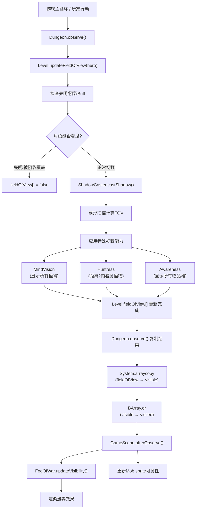
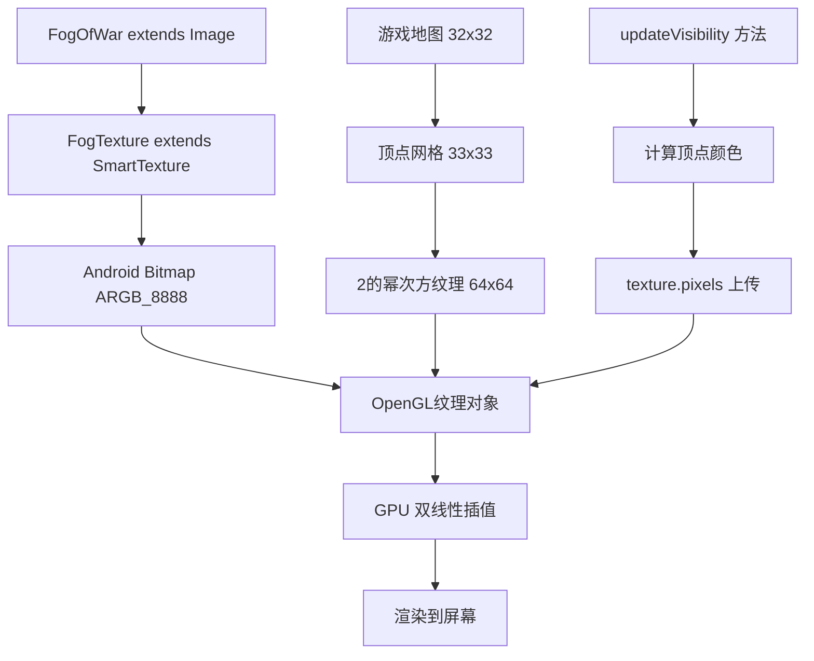
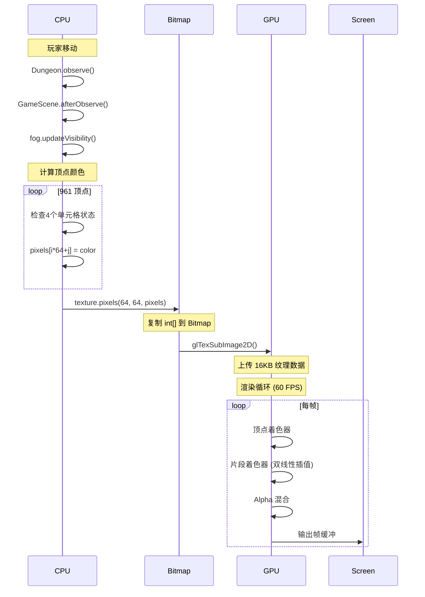
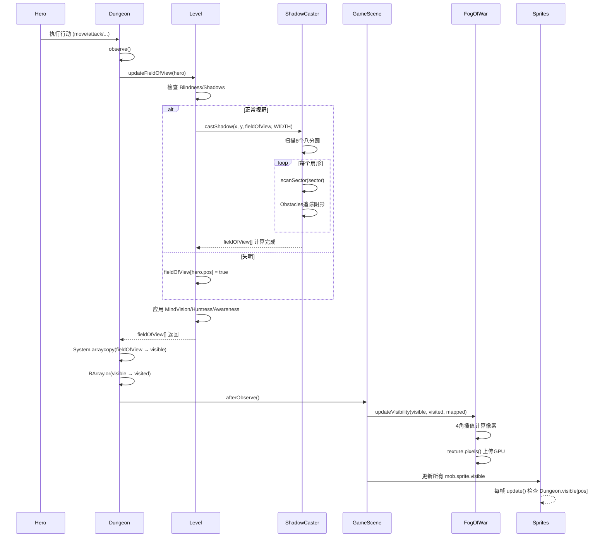

# 视野与可见性系统

## 概述

Pixel Dungeon 实现了一个完整的视野系统（Field of View, FOV），根据玩家位置和环境障碍物动态计算可见区域。该系统影响怪物AI、物品显示、地图渲染等多个游戏层面。

## 系统架构

视野系统由三个核心组件构成：



## 1. ShadowCaster 算法

### 1.1 核心原理

`ShadowCaster` 使用扇形投射算法（Sector-based Shadow Casting）计算视野。算法将视野分为8个八分圆（octant），从观察者位置向外逐行扫描，追踪遮挡物产生的"阴影扇形"。

**关键特性：**

- **最大视距**: `MAX_DISTANCE = 8` 个单元格
- **预计算表**: 使用 `rounding[]` 数组优化圆形边界判定
- **精确碰撞**: 每个遮挡物生成角度范围，阻挡后续光线

### 1.2 算法实现

```java
public class ShadowCaster {
    private static final int MAX_DISTANCE = 8;
    
    // 预计算的圆形边界表 (Bresenham圆算法)
    private static int[] rounding;
    
    static {
        rounding = new int[MAX_DISTANCE + 1];
        for (int i=1; i <= MAX_DISTANCE; i++) {
            rounding[i] = (int)Math.round( Math.sqrt( MAX_DISTANCE * MAX_DISTANCE - i * i ) );
        }
    }
    
    public static void castShadow( int x, int y, boolean[] fieldOfView, int mapWidth ) {
        // 观察者位置始终可见
        fieldOfView[y * mapWidth + x] = true;
        
        // 扫描8个八分圆方向
        for (int dir=0; dir < 8; dir++) {
            scanSector( x, y, fieldOfView, mapWidth, dir );
        }
    }
}
```

### 1.3 扇形扫描

每个八分圆使用 `Obstacles` 对象追踪阻挡角度：

```java
private static void scanSector( int cx, int cy, boolean[] fieldOfView, int mapWidth, int sector ) {
    Obstacles obs = new Obstacles();
    obs.limits[0] = 0;
    obs.nLimits = 1;
    
    // 从近到远逐行扫描
    for (int row=1; row <= MAX_DISTANCE && obs.nLimits > 0; row++) {
        int width = rounding[row];  // 该行的宽度
        
        for (int col=-width; col <= width; col++) {
            // 计算实际坐标
            Point cell = new Point(cx, cy);
            Point.toShadowCast( cell, col, row, sector );
            
            if (cell.x >= 0 && cell.x < mapWidth && ...) {
                float f0 = (float)col / (row + 2);  // 起始角度
                float f1 = (float)(col + 1) / (row + 1);  // 结束角度
                
                if (obs.isBlocked( f0, f1 )) {
                    continue;  // 被阻挡，跳过
                }
                
                // 单元格可见
                fieldOfView[cell.y * mapWidth + cell.x] = true;
                
                // 如果是障碍物，添加到阻挡列表
                if (isOpaque( cell )) {
                    obs.add( f0, f1 );
                }
            }
        }
    }
}
```

### 1.4 Obstacles 类

使用合并排序的角度区间追踪阻挡：

```java
private static class Obstacles {
    float[] limits = new float[MAX_DISTANCE * MAX_DISTANCE];
    int nLimits = 0;
    
    // 检查角度范围是否被完全阻挡
    boolean isBlocked( float f0, float f1 ) {
        for (int i=0; i < nLimits; i += 2) {
            if (limits[i] <= f0 && limits[i+1] >= f1) {
                return true;  // 完全在某个阴影扇形内
            }
        }
        return false;
    }
    
    // 添加新的阻挡区间，自动合并重叠部分
    void add( float f0, float f1 ) {
        // ... 插入排序并合并相邻区间
    }
}
```

## 2. Level 视野更新

### 2.1 updateFieldOfView 方法

`Level.updateFieldOfView()` 在 `ShadowCaster` 基础上添加游戏逻辑：

```java
public boolean[] updateFieldOfView( Char c ) {
    Arrays.fill( fieldOfView, false );
    
    int cx = c.pos % WIDTH;
    int cy = c.pos / WIDTH;
    
    // 检查失明/阴影效果
    boolean sighted = c.buff( Blindness.class ) == null && 
                      c.buff( Shadows.class ) == null && 
                      c.isAlive();
    
    if (sighted) {
        // 基础视野计算
        ShadowCaster.castShadow( cx, cy, fieldOfView, WIDTH );
    } else {
        // 失明时只能看到自己脚下
        fieldOfView[c.pos] = true;
    }
    
    // 应用可发现性约束 (某些区域无法看到)
    for (int i=0; i < LENGTH; i++) {
        fieldOfView[i] &= discoverable[i];
    }
    
    // === 特殊视野能力 ===
    
    if (c.isAlive()) {
        // MindVision: 显示所有怪物及其周围9格
        if (c.buff( MindVision.class ) != null) {
            for (Mob mob : mobs) {
                int p = mob.pos;
                for (int x = -1; x <= 1; x++)
                for (int y = -1; y <= 1; y++) {
                    fieldOfView[p + x + y * WIDTH] = true;
                }
            }
        }
        
        // Huntress职业: 距离2内能看到怪物
        if (c instanceof Hero && ((Hero)c).heroClass == HeroClass.HUNTRESS) {
            int dist = 2;
            int cx = c.pos % WIDTH;
            int cy = c.pos / WIDTH;
            
            for (Mob mob : mobs) {
                int mx = mob.pos % WIDTH;
                int my = mob.pos / WIDTH;
                if (Math.abs(mx - cx) <= dist && Math.abs(my - cy) <= dist) {
                    fieldOfView[mob.pos] = true;
                }
            }
        }
        
        // Awareness Buff: 显示所有物品堆
        if (c.buff( Awareness.class ) != null) {
            for (Heap heap : heaps.values()) {
                int p = heap.pos;
                for (int x = -1; x <= 1; x++)
                for (int y = -1; y <= 1; y++) {
                    fieldOfView[p + x + y * WIDTH] = true;
                }
            }
        }
    }
    
    return fieldOfView;
}
```

### 2.2 关键数组

```java
public abstract class Level {
    public static final int LENGTH = WIDTH * HEIGHT;  // 总单元格数
    
    // 三个状态数组
    public static boolean[] fieldOfView = new boolean[LENGTH];  // 当前帧可见
    public boolean[] visited = new boolean[LENGTH];             // 已探索(永久)
    public boolean[] mapped = new boolean[LENGTH];              // 已映射(魔法卷轴)
    public boolean[] discoverable = new boolean[LENGTH];        // 可发现约束
}
```

## 3. Dungeon 全局传播

### 3.1 observe 方法

`Dungeon.observe()` 将局部视野传播到全局状态：

```java
public class Dungeon {
    public static boolean[] visible = new boolean[Level.LENGTH];  // 全局可见数组
    
    public static void observe() {
        if (level == null) {
            return;
        }
        
        // Step 1: 更新当前角色视野
        level.updateFieldOfView( hero );
        
        // Step 2: 复制到全局数组 (高性能)
        System.arraycopy( Level.fieldOfView, 0, visible, 0, visible.length );
        
        // Step 3: 合并到已访问区域 (永久地图揭示)
        BArray.or( level.visited, visible, level.visited );
        
        // Step 4: 通知渲染系统更新
        GameScene.afterObserve();
    }
}
```

### 3.2 afterObserve 回调

```java
public static void afterObserve() {
    if (scene != null) {
        // 更新迷雾纹理
        scene.fog.updateVisibility( Dungeon.visible, Dungeon.level.visited, Dungeon.level.mapped );
        
        // 更新所有怪物精灵的可见性
        for (Mob mob : Dungeon.level.mobs) {
            mob.sprite.visible = Dungeon.visible[mob.pos];
        }
    }
}
```

## 4. FogOfWar 渲染技术深度解析

### 4.1 整体架构

`FogOfWar` 继承自 Noosa 引擎的 `Image` 类，本质上是一个 **动态生成的纹理叠加层**，覆盖在整个游戏地图之上。



### 4.2 纹理尺寸计算

#### 4.2.1 地图 vs 顶点 vs 纹理尺寸

```java
public FogOfWar( int mapWidth, int mapHeight ) {
    super();
    
    // mapWidth = 32, mapHeight = 32 (Level.WIDTH, Level.HEIGHT)
    
    // Step 1: 顶点网格 = 地图尺寸 + 1
    // 理由: 32个单元格需要33条网格线来分隔
    pWidth = mapWidth + 1;    // 33
    pHeight = mapHeight + 1;  // 33
    
    // Step 2: 纹理尺寸向上取2的幂次方
    // 理由: OpenGL ES 2.0 要求纹理尺寸为2的幂次方以支持 mipmapping
    width2 = 1;
    while (width2 < pWidth) {
        width2 <<= 1;  // 1 → 2 → 4 → 8 → 16 → 32 → 64
    }
    // 结果: width2 = 64 (因为 32 < 33 ≤ 64)
    
    height2 = 1;
    while (height2 < pHeight) {
        height2 <<= 1;
    }
    // 结果: height2 = 64
    
    // Step 3: 像素尺寸 = 纹理尺寸 × 单元格像素大小
    float size = DungeonTilemap.SIZE;  // 16 像素/单元格
    width = width2 * size;   // 64 × 16 = 1024 像素
    height = height2 * size; // 64 × 16 = 1024 像素
    
    // Step 4: 创建 Bitmap 和纹理
    texture( new FogTexture() );  // 内部创建 64x64 ARGB_8888 位图
    
    // Step 5: 设置缩放比例
    // 每个纹理像素对应 16x16 屏幕像素
    scale.set( DungeonTilemap.SIZE, DungeonTilemap.SIZE );
    
    // Step 6: 位置偏移 (居中对齐到单元格)
    x = y = -size / 2;  // -8, -8
}
```

**关键理解：**

- **地图数组**: 32×32 = 1024 个单元格 (`Level.map[]`)
- **顶点数组**: 33×33 = 1089 个顶点 (单元格的四个角)
- **纹理像素**: 64×64 = 4096 个像素 (GPU纹理，包含填充区域)
- **有效区域**: 只使用前 33×33 像素，其余填充为黑色

#### 4.2.2 坐标映射关系

```
地图单元格坐标系:
    0   1   2  ...  31
  ┌───┬───┬───┬───┬───┐
0 │   │   │   │...│   │
  ├───┼───┼───┼───┼───┤
1 │   │   │   │...│   │
  └───┴───┴───┴───┴───┘
 ...
31

顶点坐标系 (纹理像素):
    0   1   2  ...  32  33...63
  0 ●───●───●───●───●   (填充)
    │   │   │   │   │
  1 ●───●───●───●───●
    │   │   │   │   │
 ...
 32 ●───●───●───●───●
 33 (填充区域)
 ...
 63
```

### 4.3 迷雾颜色编码 (ARGB格式)

```java
// ARGB 格式: 0xAARRGGBB (每个通道 8 位)
private static final int VISIBLE    = 0x00000000;  // Alpha=0x00 (完全透明)
private static final int VISITED    = 0xcc111111;  // Alpha=0xCC (80%不透明)
private static final int MAPPED     = 0xcc442211;  // Alpha=0xCC (棕色调)
private static final int INVISIBLE  = 0xFF000000;  // Alpha=0xFF (完全不透明黑色)
```

**颜色解码：**

| 状态 | 十六进制 | Alpha | Red | Green | Blue | 视觉效果 |
|------|---------|-------|-----|-------|------|---------|
| VISIBLE | 0x00000000 | 0% | 0 | 0 | 0 | 完全透明，可见地面 |
| VISITED | 0xcc111111 | 80% | 17 | 17 | 17 | 深灰半透明，已探索 |
| MAPPED | 0xcc442211 | 80% | 68 | 34 | 17 | 棕色半透明，魔法映射 |
| INVISIBLE | 0xFF000000 | 100% | 0 | 0 | 0 | 完全黑色，未知区域 |

**亮度模式调整** (GameScene.brightness):

```java
public void brightness( boolean value ) {
    if (value) {
        fog.am = +2f;  // 颜色乘法因子 × 2 (变亮)
        fog.aa = -1f;  // 透明度加法偏移 -1 (更透明)
    } else {
        fog.am = +1f;  // 正常
        fog.aa =  0f;  // 正常
    }
}
// am = alpha multiplier, aa = alpha additive
```

### 4.4 顶点着色算法 (4角检测)

#### 4.4.1 核心逻辑

```java
public void updateVisibility( boolean[] visible, boolean[] visited, boolean[] mapped ) {
    if (pixels == null) {
        pixels = new int[width2 * height2];  // 64 × 64
        Arrays.fill( pixels, INVISIBLE );
    }
    
    // 遍历有效顶点区域 (1 到 pHeight-2, 1 到 pWidth-2)
    // 跳过边界: 避免数组越界，边界顶点保持黑色
    for (int i=1; i < pHeight - 1; i++) {      // i: 1...31 (纹理行)
        int pos = (pWidth - 1) * i;            // pos: 地图数组索引
        
        for (int j=1; j < pWidth - 1; j++) {   // j: 1...31 (纹理列)
            pos++;  // 移动到下一个地图单元格
            
            int c = INVISIBLE;  // 默认黑色
            
            // 检查顶点周围的4个单元格 (左上、右上、左下、右下)
            // pos 对应地图单元格的 **右下角顶点**
            
            boolean allVisible = 
                visible[pos] &&                      // 右下 (当前)
                visible[pos - (pWidth - 1)] &&       // 右上 (上一行)
                visible[pos - 1] &&                  // 左下 (左侧)
                visible[pos - (pWidth - 1) - 1];     // 左上 (对角)
            
            if (allVisible) {
                c = VISIBLE;  // 四个单元格都可见 → 顶点完全透明
            } else {
                boolean allVisited = 
                    visited[pos] && 
                    visited[pos - (pWidth - 1)] && 
                    visited[pos - 1] && 
                    visited[pos - (pWidth - 1) - 1];
                
                if (allVisited) {
                    c = VISITED;  // 四个单元格都已访问 → 顶点半透明灰
                } else {
                    boolean allMapped = 
                        mapped[pos] && 
                        mapped[pos - (pWidth - 1)] && 
                        mapped[pos - 1] && 
                        mapped[pos - (pWidth - 1) - 1];
                    
                    if (allMapped) {
                        c = MAPPED;  // 四个单元格都已映射 → 顶点棕色
                    }
                }
            }
            
            // 写入纹理像素 (注意坐标转换)
            pixels[i * width2 + j] = c;
        }
    }
    
    // 上传到 GPU
    texture.pixels( width2, height2, pixels );
}
```

#### 4.4.2 坐标转换详解

```
地图数组索引计算:
pos = y * (pWidth - 1) + x
    = y * 32 + x

示例: 顶点 (j=5, i=3) 对应地图单元格右下角
pos = 3 * 32 + 5 = 101

检查的4个单元格:
- pos - (pWidth-1) - 1 = 101 - 32 - 1 = 68  (左上)
- pos - (pWidth-1)     = 101 - 32     = 69  (右上)
- pos - 1              = 101 - 1      = 100 (左下)
- pos                  = 101               (右下)

纹理像素索引:
pixels[i * width2 + j] = pixels[3 * 64 + 5] = pixels[197]
```

**为什么是 `(pWidth - 1)`？**

- `pWidth = 33` (顶点数)
- `pWidth - 1 = 32` (单元格数 = Level.WIDTH)
- 地图数组使用 32 作为行宽度

#### 4.4.3 视觉效果原理

```
场景1: 可见边界
  [V] [V]     V = Visible
  [V] [?]     ? = Visited

顶点颜色:
  V───V
  │   │
  V───?  ← 该顶点周围4格不全为Visible，保持黑色

GPU双线性插值后:
  透明──透明
   │渐变│
  透明──黑色  ← 产生平滑过渡边缘
  

场景2: 全部可见
  [V] [V]
  [V] [V]

顶点颜色:
  V───V
  │   │
  V───V  ← 该顶点周围4格全Visible，设为透明

渲染结果: 整个区域完全透明，地面可见
```

### 4.5 GPU纹理上传与渲染

#### 4.5.1 SmartTexture 机制

```java
private class FogTexture extends SmartTexture {
    
    public FogTexture() {
        // 创建 Android 位图 (CPU 内存)
        super( Bitmap.createBitmap( width2, height2, Bitmap.Config.ARGB_8888 ) );
        
        // 设置纹理过滤模式
        filter( Texture.LINEAR, Texture.LINEAR );
        // LINEAR: 双线性插值，产生平滑效果
        // 替代方案: NEAREST (最近邻插值，产生像素化效果)
        
        // 注册到纹理缓存 (避免重复加载)
        TextureCache.add( FogOfWar.class, this );
    }
    
    @Override
    public void reload() {
        // OpenGL 上下文丢失时 (如切换应用) 自动重载
        super.reload();
        GameScene.afterObserve();  // 重新计算可见性
    }
}
```

#### 4.5.2 像素上传流程

```java
texture.pixels( width2, height2, pixels );
```

**底层操作序列 (推测 Noosa 实现):**

1. 锁定 Bitmap 内存区域
2. 将 `int[] pixels` 复制到 Bitmap 像素缓冲区
3. 调用 `glTexSubImage2D()` 上传到 GPU
4. 解锁 Bitmap

**性能考量：**

- **更新频率**: 每次玩家移动后调用 1 次 (约 0.5-1 秒/次)
- **数据量**: 64×64×4字节 = 16KB (可接受)
- **优化**: 只更新脏区域？当前实现全量更新

### 4.6 双线性插值渲染效果

#### 4.6.1 GPU自动插值

```
纹理像素 (1x1 纹理像素 → 16x16 屏幕像素):

顶点A(透明)──────────────顶点B(黑色)
    │                      │
    │                      │
    │     GPU自动插值       │
    │    产生渐变过渡       │
    │                      │
顶点C(透明)──────────────顶点D(透明)

渲染结果 (16×16像素):
████████████████  ← 顶部中心渐变
████████████▓▓▓▓  ← 右上角变暗
████████████▓▓▓▓
████████████░░░░  ← 逐渐变亮
████████████░░░░
████████████        ← 底部完全透明
```

**技术实现:**

- OpenGL `GL_LINEAR` 过滤模式启用双线性插值
- 片段着色器对相邻4个纹理像素采样加权平均
- 权重由片段在纹理坐标中的位置决定

#### 4.6.2 缩放计算

```java
// FogOfWar 构造函数
scale.set( DungeonTilemap.SIZE, DungeonTilemap.SIZE );  // 16, 16
```

**渲染管线:**

```
纹理坐标 (0,0)-(1,1) 
    ↓ 缩放 × 16
顶点坐标 (0,0)-(64,64) 纹理像素单位
    ↓ 再缩放 × 16 (通过 scale.set)
屏幕坐标 (0,0)-(1024,1024) 像素单位
```

**位置偏移:**

```java
x = y = -size / 2;  // -8, -8

// 原因: DungeonTilemap 绘制单元格时:
// - 单元格 (0,0) 的屏幕坐标为 (0,0)-(16,16)
// - 顶点 (0,0) 应对齐到单元格中心
// - 偏移 -8 使顶点对齐到单元格左上角
```

### 4.7 边界处理策略

```java
// 为什么循环从 1 开始，到 pHeight-2 结束？
for (int i=1; i < pHeight - 1; i++) {
    for (int j=1; j < pWidth - 1; j++) {
        // ...
    }
}
```

**理由分析:**

1. **避免数组越界**
   - 访问 `pos - (pWidth-1) - 1` 时，如果 `i=0, j=0`，会导致负索引

2. **边界始终黑色**
   - 地图边缘外的顶点保持 `INVISIBLE` (默认值)
   - 产生自然的边界遮罩效果

3. **有效范围**
   - 实际更新: 31×31 = 961 个顶点
   - 跳过边界: 33×33 - 31×31 = 128 个顶点

### 4.8 完整渲染流程时序图



### 4.9 性能优化技术

#### 4.9.1 使用的优化

1. **2的幂次方纹理**
   - GPU 硬件加速 mipmapping
   - 缓存友好的地址计算

2. **按需更新**
   - 只在 `observe()` 时更新，非每帧
   - 避免冗余计算

3. **原生数组**
   - `int[] pixels` 直接内存操作
   - 避免对象封装开销

#### 4.9.2 潜在改进

1. **脏矩形更新**

   ```java
   // 当前: 全量更新 64×64
   texture.pixels( width2, height2, pixels );
   
   // 优化: 只更新变化区域
   // texture.pixels( x, y, width, height, pixels, offset );
   ```

2. **纹理压缩**
   - 使用 ETC1/ETC2 压缩格式
   - 节省 GPU 内存 (当前 16KB → 压缩后 ~4KB)

3. **顶点颜色代替纹理**
   - 直接在顶点数组存储颜色
   - 避免纹理上传开销

### 4.10 关键要点总结

| 方面 | 技术细节 |
|------|---------|
| **纹理尺寸** | 33×33 顶点 → 64×64 纹理 (2的幂次方填充) |
| **坐标映射** | 顶点(i,j) → 地图单元格右下角 → 检查周围4格 |
| **颜色编码** | ARGB_8888: 透明/灰/棕/黑 四种状态 |
| **插值模式** | GL_LINEAR 双线性插值产生平滑边缘 |
| **缩放比例** | 1纹理像素 → 16×16屏幕像素 |
| **更新策略** | 每次玩家行动后全量更新 961 顶点 |
| **渲染层级** | 覆盖在地图层之上，使用 Alpha 混合 |

**设计亮点：**

1. **4角检测** → 只有完全探索的区域才透明，避免信息泄漏
2. **双线性插值** → 自动产生平滑渐变，无需手动反走样
3. **多状态支持** → 可见/已访问/已映射三级渐进式揭示
4. **亮度适配** → 通过颜色矩阵支持明亮模式

## 5. 游戏逻辑集成

### 5.1 精灵可见性

所有游戏对象根据 `Dungeon.visible[]` 更新：

```java
// 物品精灵
public class ItemSprite extends MovieClip {
    @Override
    public void update() {
        super.update();
        visible = (heap == null || Dungeon.visible[heap.pos]);
        // ...
    }
}

// 植物精灵
public class PlantSprite extends Image {
    @Override
    public void update() {
        super.update();
        visible = pos == -1 || Dungeon.visible[pos];
        // ...
    }
}

// 怪物移动动画
public abstract class Mob extends Char {
    protected boolean moveSprite( int from, int to ) {
        if (sprite.isVisible() && (Dungeon.visible[from] || Dungeon.visible[to])) {
            sprite.move( from, to );  // 播放移动动画
        } else {
            sprite.place( to );  // 直接传送
        }
        return true;
    }
}
```

### 5.2 怪物AI感知

怪物的状态转换依赖视野系统：

```java
public abstract class Mob extends Char {
    @Override
    protected boolean act() {
        // ...
        enemy = chooseEnemy();
        
        // 如果玩家可见，切换到HUNTING状态
        if (enemySeen) {
            state = HUNTING;
        }
        // ...
    }
    
    protected Char chooseEnemy() {
        // 检查是否能看到英雄
        if (enemy == null || !enemy.isAlive()) {
            HashSet<Char> enemies = new HashSet<Char>();
            for (Mob mob : Dungeon.level.mobs) {
                if (mob != this && Level.fieldOfView[mob.pos] && ...) {
                    enemies.add( mob );
                }
            }
            return enemies.isEmpty() ? null : Random.element( enemies );
        }
        return enemy;
    }
}
```

### 5.3 特殊效果

地牢特效（如矿脉闪光）也遵循视野规则：

```java
// CavesLevel 的矿脉效果
private static class Vein extends Group {
    @Override
    public void update() {
        if (visible = Dungeon.visible[pos]) {
            super.update();
            
            if ((delay -= Game.elapsed) <= 0) {
                // 只在可见时产生粒子效果
                ((Sparkle)recycle( Sparkle.class )).reset( ... );
            }
        }
    }
}
```

## 6. 性能优化

### 6.1 预计算表

```java
// ShadowCaster 使用 Bresenham 圆算法预计算
private static int[] rounding = new int[MAX_DISTANCE + 1];
static {
    for (int i=1; i <= MAX_DISTANCE; i++) {
        rounding[i] = (int)Math.round( Math.sqrt( MAX_DISTANCE * MAX_DISTANCE - i * i ) );
    }
}
```

### 6.2 数组操作

```java
// 使用原生方法高效复制
System.arraycopy( Level.fieldOfView, 0, visible, 0, visible.length );

// 使用位运算合并数组
BArray.or( level.visited, visible, level.visited );
```

### 6.3 按需更新

- 只在玩家行动后调用 `Dungeon.observe()`
- 精灵使用标志位 `visible` 避免重复判断
- 纹理更新使用脏标记机制

## 7. 完整调用链



## 8. 关键要点总结

| 组件 | 职责 | 关键方法 |
|------|------|----------|
| **ShadowCaster** | 几何算法 | `castShadow()` - 扇形光线投射 |
| **Level** | 游戏逻辑 | `updateFieldOfView()` - Buff与特殊能力 |
| **Dungeon** | 全局状态 | `observe()` - 传播与永久化 |
| **FogOfWar** | 视觉渲染 | `updateVisibility()` - 纹理生成 |
| **GameScene** | 协调器 | `afterObserve()` - 通知所有对象 |

**设计优势：**

1. **分层清晰**：算法、逻辑、渲染三层分离
2. **性能优化**：预计算表、原生数组操作、按需更新
3. **扩展性**：Buff系统轻松添加新视野效果
4. **视觉平滑**：4角插值产生柔和边缘
5. **状态持久化**：`visited[]` 永久记录探索历史

**典型应用场景：**

- 玩家移动后实时更新视野
- 怪物AI判断是否追击
- 隐藏门/陷阱的发现机制
- 魔法卷轴（Magic Mapping）揭示地图
- 光照类道具（Torch）扩展视野
