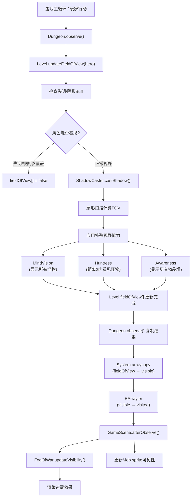
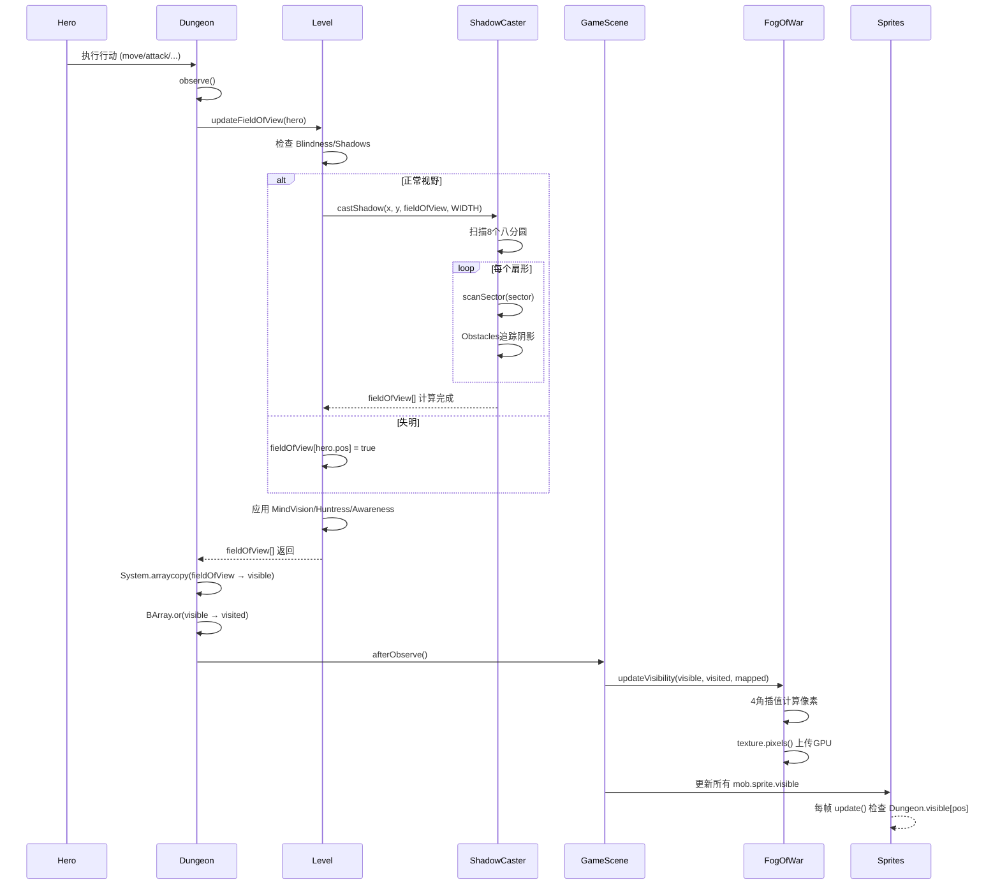

# 视野与可见性系统

## 概述

Pixel Dungeon 实现了一个完整的视野系统（Field of View, FOV），根据玩家位置和环境障碍物动态计算可见区域。该系统影响怪物AI、物品显示、地图渲染等多个游戏层面。

## 系统架构

视野系统由三个核心组件构成：



## 1. ShadowCaster 算法

### 1.1 核心原理

`ShadowCaster` 使用扇形投射算法（Sector-based Shadow Casting）计算视野。算法将视野分为8个八分圆（octant），从观察者位置向外逐行扫描，追踪遮挡物产生的"阴影扇形"。

**关键特性：**

- **最大视距**: `MAX_DISTANCE = 8` 个单元格
- **预计算表**: 使用 `rounding[]` 数组优化圆形边界判定
- **精确碰撞**: 每个遮挡物生成角度范围，阻挡后续光线

### 1.2 算法实现

```java
public class ShadowCaster {
    private static final int MAX_DISTANCE = 8;
    
    // 预计算的圆形边界表 (Bresenham圆算法)
    private static int[] rounding;
    
    static {
        rounding = new int[MAX_DISTANCE + 1];
        for (int i=1; i <= MAX_DISTANCE; i++) {
            rounding[i] = (int)Math.round( Math.sqrt( MAX_DISTANCE * MAX_DISTANCE - i * i ) );
        }
    }
    
    public static void castShadow( int x, int y, boolean[] fieldOfView, int mapWidth ) {
        // 观察者位置始终可见
        fieldOfView[y * mapWidth + x] = true;
        
        // 扫描8个八分圆方向
        for (int dir=0; dir < 8; dir++) {
            scanSector( x, y, fieldOfView, mapWidth, dir );
        }
    }
}
```

### 1.3 扇形扫描

每个八分圆使用 `Obstacles` 对象追踪阻挡角度：

```java
private static void scanSector( int cx, int cy, boolean[] fieldOfView, int mapWidth, int sector ) {
    Obstacles obs = new Obstacles();
    obs.limits[0] = 0;
    obs.nLimits = 1;
    
    // 从近到远逐行扫描
    for (int row=1; row <= MAX_DISTANCE && obs.nLimits > 0; row++) {
        int width = rounding[row];  // 该行的宽度
        
        for (int col=-width; col <= width; col++) {
            // 计算实际坐标
            Point cell = new Point(cx, cy);
            Point.toShadowCast( cell, col, row, sector );
            
            if (cell.x >= 0 && cell.x < mapWidth && ...) {
                float f0 = (float)col / (row + 2);  // 起始角度
                float f1 = (float)(col + 1) / (row + 1);  // 结束角度
                
                if (obs.isBlocked( f0, f1 )) {
                    continue;  // 被阻挡，跳过
                }
                
                // 单元格可见
                fieldOfView[cell.y * mapWidth + cell.x] = true;
                
                // 如果是障碍物，添加到阻挡列表
                if (isOpaque( cell )) {
                    obs.add( f0, f1 );
                }
            }
        }
    }
}
```

### 1.4 Obstacles 类

使用合并排序的角度区间追踪阻挡：

```java
private static class Obstacles {
    float[] limits = new float[MAX_DISTANCE * MAX_DISTANCE];
    int nLimits = 0;
    
    // 检查角度范围是否被完全阻挡
    boolean isBlocked( float f0, float f1 ) {
        for (int i=0; i < nLimits; i += 2) {
            if (limits[i] <= f0 && limits[i+1] >= f1) {
                return true;  // 完全在某个阴影扇形内
            }
        }
        return false;
    }
    
    // 添加新的阻挡区间，自动合并重叠部分
    void add( float f0, float f1 ) {
        // ... 插入排序并合并相邻区间
    }
}
```

## 2. Level 视野更新

### 2.1 updateFieldOfView 方法

`Level.updateFieldOfView()` 在 `ShadowCaster` 基础上添加游戏逻辑：

```java
public boolean[] updateFieldOfView( Char c ) {
    Arrays.fill( fieldOfView, false );
    
    int cx = c.pos % WIDTH;
    int cy = c.pos / WIDTH;
    
    // 检查失明/阴影效果
    boolean sighted = c.buff( Blindness.class ) == null && 
                      c.buff( Shadows.class ) == null && 
                      c.isAlive();
    
    if (sighted) {
        // 基础视野计算
        ShadowCaster.castShadow( cx, cy, fieldOfView, WIDTH );
    } else {
        // 失明时只能看到自己脚下
        fieldOfView[c.pos] = true;
    }
    
    // 应用可发现性约束 (某些区域无法看到)
    for (int i=0; i < LENGTH; i++) {
        fieldOfView[i] &= discoverable[i];
    }
    
    // === 特殊视野能力 ===
    
    if (c.isAlive()) {
        // MindVision: 显示所有怪物及其周围9格
        if (c.buff( MindVision.class ) != null) {
            for (Mob mob : mobs) {
                int p = mob.pos;
                for (int x = -1; x <= 1; x++)
                for (int y = -1; y <= 1; y++) {
                    fieldOfView[p + x + y * WIDTH] = true;
                }
            }
        }
        
        // Huntress职业: 距离2内能看到怪物
        if (c instanceof Hero && ((Hero)c).heroClass == HeroClass.HUNTRESS) {
            int dist = 2;
            int cx = c.pos % WIDTH;
            int cy = c.pos / WIDTH;
            
            for (Mob mob : mobs) {
                int mx = mob.pos % WIDTH;
                int my = mob.pos / WIDTH;
                if (Math.abs(mx - cx) <= dist && Math.abs(my - cy) <= dist) {
                    fieldOfView[mob.pos] = true;
                }
            }
        }
        
        // Awareness Buff: 显示所有物品堆
        if (c.buff( Awareness.class ) != null) {
            for (Heap heap : heaps.values()) {
                int p = heap.pos;
                for (int x = -1; x <= 1; x++)
                for (int y = -1; y <= 1; y++) {
                    fieldOfView[p + x + y * WIDTH] = true;
                }
            }
        }
    }
    
    return fieldOfView;
}
```

### 2.2 关键数组

```java
public abstract class Level {
    public static final int LENGTH = WIDTH * HEIGHT;  // 总单元格数
    
    // 三个状态数组
    public static boolean[] fieldOfView = new boolean[LENGTH];  // 当前帧可见
    public boolean[] visited = new boolean[LENGTH];             // 已探索(永久)
    public boolean[] mapped = new boolean[LENGTH];              // 已映射(魔法卷轴)
    public boolean[] discoverable = new boolean[LENGTH];        // 可发现约束
}
```

## 3. Dungeon 全局传播

### 3.1 observe 方法

`Dungeon.observe()` 将局部视野传播到全局状态：

```java
public class Dungeon {
    public static boolean[] visible = new boolean[Level.LENGTH];  // 全局可见数组
    
    public static void observe() {
        if (level == null) {
            return;
        }
        
        // Step 1: 更新当前角色视野
        level.updateFieldOfView( hero );
        
        // Step 2: 复制到全局数组 (高性能)
        System.arraycopy( Level.fieldOfView, 0, visible, 0, visible.length );
        
        // Step 3: 合并到已访问区域 (永久地图揭示)
        BArray.or( level.visited, visible, level.visited );
        
        // Step 4: 通知渲染系统更新
        GameScene.afterObserve();
    }
}
```

### 3.2 afterObserve 回调

```java
public static void afterObserve() {
    if (scene != null) {
        // 更新迷雾纹理
        scene.fog.updateVisibility( Dungeon.visible, Dungeon.level.visited, Dungeon.level.mapped );
        
        // 更新所有怪物精灵的可见性
        for (Mob mob : Dungeon.level.mobs) {
            mob.sprite.visible = Dungeon.visible[mob.pos];
        }
    }
}
```

## 4. FogOfWar 渲染

### 4.1 迷雾状态

`FogOfWar` 使用纹理渲染四种地图状态：

```java
public class FogOfWar extends Image {
    private static final int VISIBLE    = 0x00000000;  // 完全透明(当前可见)
    private static final int VISITED    = 0xcc111111;  // 半透明灰色(已探索)
    private static final int MAPPED     = 0xcc442211;  // 半透明棕色(已映射)
    private static final int INVISIBLE  = 0xFF000000;  // 完全黑色(未知)
    
    private int[] pixels;  // 纹理像素数据
}
```

### 4.2 可见性更新

使用 **4角插值** 平滑边缘：

```java
public void updateVisibility( boolean[] visible, boolean[] visited, boolean[] mapped ) {
    if (pixels == null) {
        pixels = new int[width2 * height2];
        Arrays.fill( pixels, INVISIBLE );
    }
    
    // 遍历每个纹理像素 (对应地图单元格的角)
    for (int i=1; i < pHeight - 1; i++) {
        int pos = (pWidth - 1) * i;
        for (int j=1; j < pWidth - 1; j++) {
            pos++;
            int c = INVISIBLE;
            
            // 检查四个相邻单元格 (左上、上、左、自己)
            if (visible[pos] && visible[pos - (pWidth - 1)] && 
                visible[pos - 1] && visible[pos - (pWidth - 1) - 1]) {
                c = VISIBLE;  // 四个都可见 → 完全透明
            } else 
            if (visited[pos] && visited[pos - (pWidth - 1)] && 
                visited[pos - 1] && visited[pos - (pWidth - 1) - 1]) {
                c = VISITED;  // 四个都已访问 → 半透明
            }
            else 
            if (mapped[pos] && mapped[pos - (pWidth - 1)] && 
                mapped[pos - 1] && mapped[pos - (pWidth - 1) - 1]) {
                c = MAPPED;   // 四个都已映射 → 淡棕色
            }
            
            pixels[i * width2 + j] = c;
        }
    }
    
    // 上传到GPU纹理
    texture.pixels( width2, height2, pixels );
}
```

**4角插值原理**：

- 每个纹理像素代表地图单元格的 **顶点**
- 只有四个相邻单元格都处于同一状态，该顶点才显示对应颜色
- 这样在边界产生平滑过渡效果（OpenGL会自动插值）

## 5. 游戏逻辑集成

### 5.1 精灵可见性

所有游戏对象根据 `Dungeon.visible[]` 更新：

```java
// 物品精灵
public class ItemSprite extends MovieClip {
    @Override
    public void update() {
        super.update();
        visible = (heap == null || Dungeon.visible[heap.pos]);
        // ...
    }
}

// 植物精灵
public class PlantSprite extends Image {
    @Override
    public void update() {
        super.update();
        visible = pos == -1 || Dungeon.visible[pos];
        // ...
    }
}

// 怪物移动动画
public abstract class Mob extends Char {
    protected boolean moveSprite( int from, int to ) {
        if (sprite.isVisible() && (Dungeon.visible[from] || Dungeon.visible[to])) {
            sprite.move( from, to );  // 播放移动动画
        } else {
            sprite.place( to );  // 直接传送
        }
        return true;
    }
}
```

### 5.2 怪物AI感知

怪物的状态转换依赖视野系统：

```java
public abstract class Mob extends Char {
    @Override
    protected boolean act() {
        // ...
        enemy = chooseEnemy();
        
        // 如果玩家可见，切换到HUNTING状态
        if (enemySeen) {
            state = HUNTING;
        }
        // ...
    }
    
    protected Char chooseEnemy() {
        // 检查是否能看到英雄
        if (enemy == null || !enemy.isAlive()) {
            HashSet<Char> enemies = new HashSet<Char>();
            for (Mob mob : Dungeon.level.mobs) {
                if (mob != this && Level.fieldOfView[mob.pos] && ...) {
                    enemies.add( mob );
                }
            }
            return enemies.isEmpty() ? null : Random.element( enemies );
        }
        return enemy;
    }
}
```

### 5.3 特殊效果

地牢特效（如矿脉闪光）也遵循视野规则：

```java
// CavesLevel 的矿脉效果
private static class Vein extends Group {
    @Override
    public void update() {
        if (visible = Dungeon.visible[pos]) {
            super.update();
            
            if ((delay -= Game.elapsed) <= 0) {
                // 只在可见时产生粒子效果
                ((Sparkle)recycle( Sparkle.class )).reset( ... );
            }
        }
    }
}
```

## 6. 性能优化

### 6.1 预计算表

```java
// ShadowCaster 使用 Bresenham 圆算法预计算
private static int[] rounding = new int[MAX_DISTANCE + 1];
static {
    for (int i=1; i <= MAX_DISTANCE; i++) {
        rounding[i] = (int)Math.round( Math.sqrt( MAX_DISTANCE * MAX_DISTANCE - i * i ) );
    }
}
```

### 6.2 数组操作

```java
// 使用原生方法高效复制
System.arraycopy( Level.fieldOfView, 0, visible, 0, visible.length );

// 使用位运算合并数组
BArray.or( level.visited, visible, level.visited );
```

### 6.3 按需更新

- 只在玩家行动后调用 `Dungeon.observe()`
- 精灵使用标志位 `visible` 避免重复判断
- 纹理更新使用脏标记机制

## 7. 完整调用链



## 8. 关键要点总结

| 组件 | 职责 | 关键方法 |
|------|------|----------|
| **ShadowCaster** | 几何算法 | `castShadow()` - 扇形光线投射 |
| **Level** | 游戏逻辑 | `updateFieldOfView()` - Buff与特殊能力 |
| **Dungeon** | 全局状态 | `observe()` - 传播与永久化 |
| **FogOfWar** | 视觉渲染 | `updateVisibility()` - 纹理生成 |
| **GameScene** | 协调器 | `afterObserve()` - 通知所有对象 |

**设计优势：**

1. **分层清晰**：算法、逻辑、渲染三层分离
2. **性能优化**：预计算表、原生数组操作、按需更新
3. **扩展性**：Buff系统轻松添加新视野效果
4. **视觉平滑**：4角插值产生柔和边缘
5. **状态持久化**：`visited[]` 永久记录探索历史

**典型应用场景：**

- 玩家移动后实时更新视野
- 怪物AI判断是否追击
- 隐藏门/陷阱的发现机制
- 魔法卷轴（Magic Mapping）揭示地图
- 光照类道具（Torch）扩展视野
