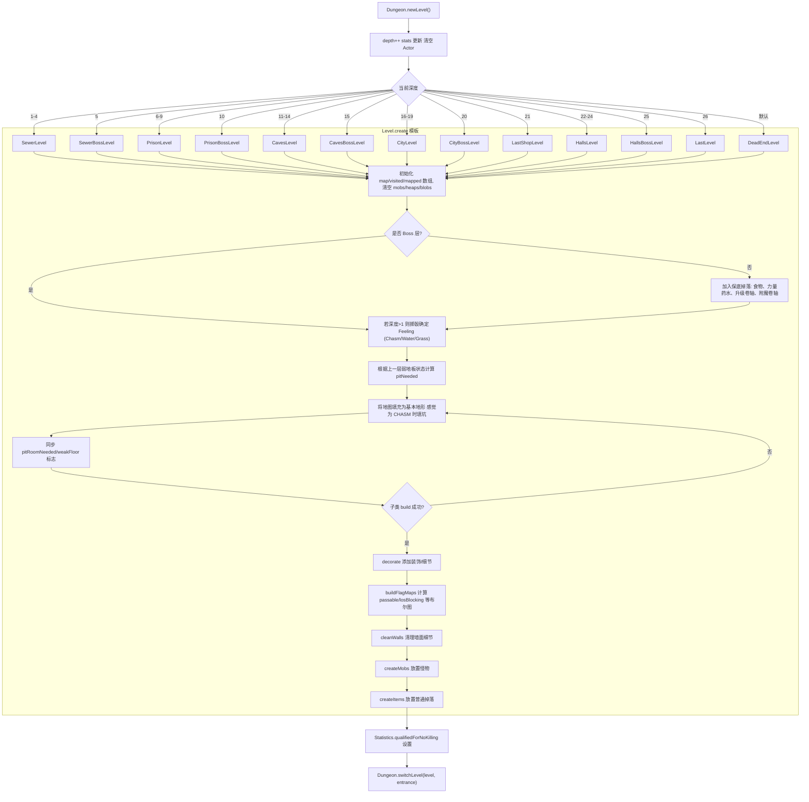

# Level Generation Flow

该文档概述 `Dungeon.newLevel()` 触发的楼层生成流程，并聚焦 `levels/Level.create()` 中的模板逻辑。不同楼层（如 `SewerLevel`, `PrisonLevel` 等）只需覆写 `build/decorate/createMobs/createItems`，即可在统一骨架上定制地图与内容。

## Mermaid 流程图

## 关键节点说明

- **保底掉落**：`Generator.random(FOOD)` 以及按需插入的力量药水、升级卷轴、附魔卷轴通过 `itemsToSpawn` 延迟到 `createItems()` 中实际落地。
- **Feeling 机制**：在非 Boss 层随机选择 CHASM/WATER/GRASS，驱动 `build()` 的初始填充与后续装饰氛围。
- **循环生成**：`build()` 返回 `false` 时会重新填充地图并再次尝试，直到满足拓扑约束（房间数量、入口出口连通等）。
- **Flag Maps**：`buildFlagMaps()` 根据最终地形计算 `passable`, `pit`, `water`, `losBlocking` 等静态数组，为寻路与视野提供 O(1) 查询。
- **内容注入**：`createMobs()` 与 `createItems()` 是子类最主要的自定义点，负责将 `itemsToSpawn` 和额外生成逻辑落地。

通过以上流程，任何新楼层类型都能在不修改全局逻辑的前提下插入到 `Dungeon.newLevel()` 的分支，并重用 `Level.create()` 的公共步骤。
