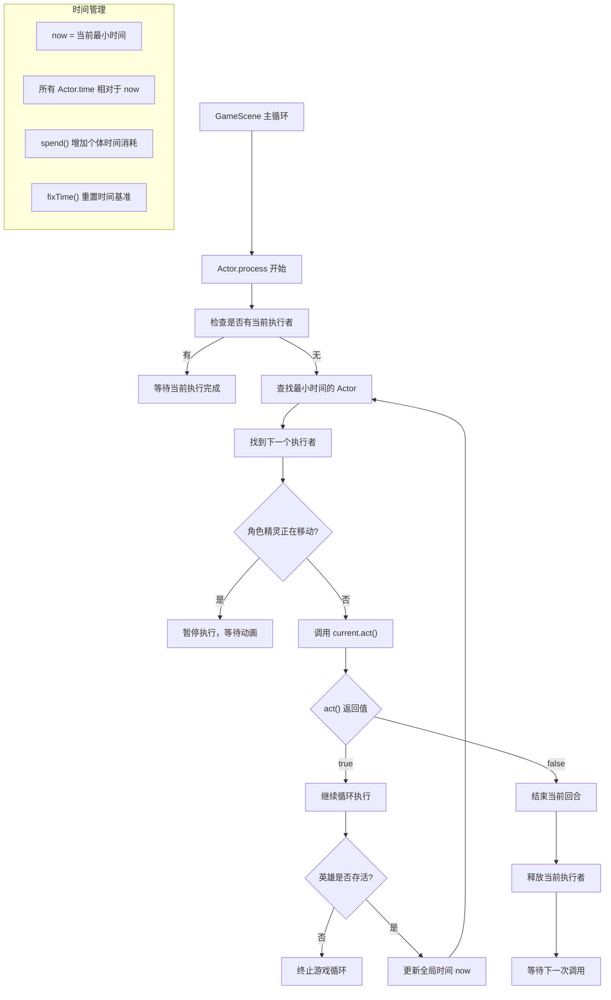
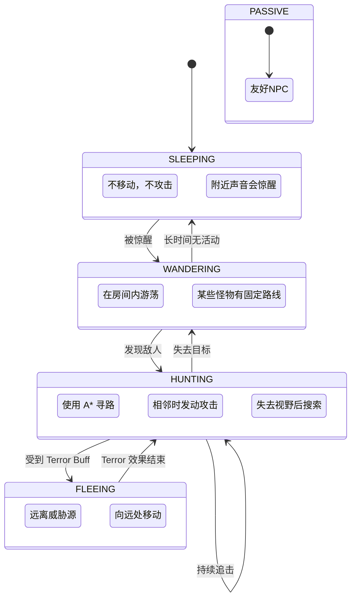
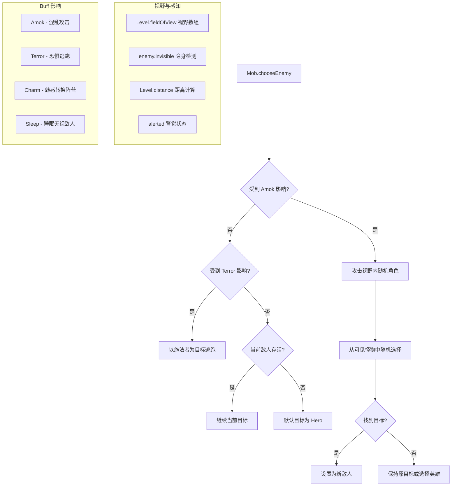
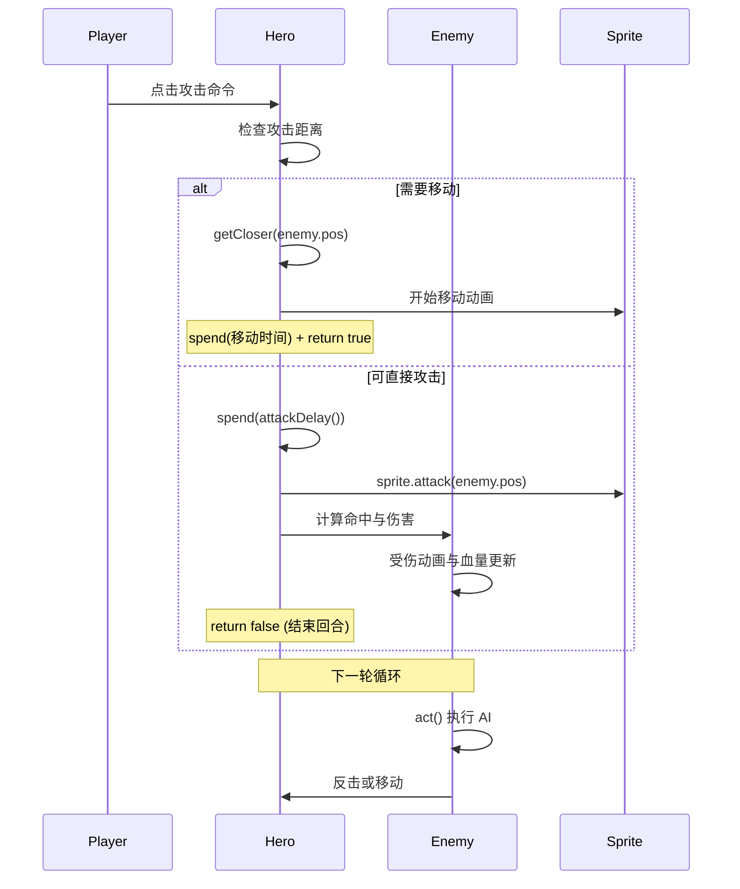

# 回合制游戏机制详解

该文档深入分析 Pixel Dungeon 的回合制（Turn-based）游戏机制，包括 Actor 时间调度系统、英雄与怪物的行动逻辑、以及回合制战斗的实现细节。

## 回合制系统概览

Pixel Dungeon 采用 **基于时间的回合调度系统**，而非传统的严格轮流制：

- **时间轮机制**：所有实体（Hero、Mob、Buff、Blob）都有 `time` 字段表示下次行动时间
- **优先队列调度**：`Actor.process()` 按最小时间优先调度实体执行 `act()` 方法
- **连续行动支持**：速度快的实体可能连续行动多次，速度慢的实体可能被跳过
- **动画同步**：等待角色移动动画完成再处理下一个行动

## 核心调度算法

### 1. Actor 时间轮调度器



**关键代码逻辑**：

```java
public static void process() {
    if (current != null) return; // 防止重入
    
    boolean doNext;
    do {
        // 查找下次行动时间最小的 Actor
        now = Float.MAX_VALUE;
        current = null;
        for (Actor actor : all) {
            if (actor.time < now) {
                now = actor.time;
                current = actor;
            }
        }
        
        if (current != null) {
            // 检查动画状态
            if (current instanceof Char && 
                ((Char)current).sprite.isMoving) {
                current = null;
                break; // 等待动画完成
            }
            
            // 执行行动并决定是否继续
            doNext = current.act();
            if (doNext && !Dungeon.hero.isAlive()) {
                doNext = false; // 英雄死亡则停止
            }
        } else {
            doNext = false;
        }
    } while (doNext);
}
```

### 2. 时间消耗与速度系统

```mermaid
flowchart TD
    A[实体执行行动] --> B[计算基础时间消耗]
    B --> C[应用速度修正]
    C --> D[调用 spend(time)]
    
    subgraph 速度影响因子
        E[基础速度 baseSpeed]
        F[Buff: Slow - 减速 50%]
        G[Buff: Speed - 加速 100%]
        H[Buff: Cripple - 减速 50%]
        I[Ring of Haste - 指数加速]
        J[饥饿状态影响移动]
    end
    
    D --> K[更新 this.time += adjustedTime]
    K --> L[角色进入冷却状态]
    
    subgraph 行动时间常量
        M[TICK = 1.0 - 标准行动]
        N[TIME_TO_REST = 1.0 - 休息]
        O[TIME_TO_SEARCH = 2.0 - 搜索]
        P[attackDelay() - 武器攻击延迟]
        Q[Key.TIME_TO_UNLOCK - 开锁时间]
    end
```

**速度计算示例**：

```java
// Hero 的速度修正
public void spend(float time) {
    int hasteLevel = 0;
    for (RingOfHaste.Haste buff : buffs(RingOfHaste.Haste.class)) {
        hasteLevel += buff.level;
    }
    float adjustedTime = hasteLevel == 0 ? time : 
        (float)(time * Math.pow(1.1, -hasteLevel));
    super.spend(adjustedTime);
}

// Char 基础速度系统
public float speed() {
    return buff(Cripple.class) == null ? baseSpeed : baseSpeed * 0.5f;
}

@Override
protected void spend(float time) {
    float timeScale = 1f;
    if (buff(Slow.class) != null) timeScale *= 0.5f;
    if (buff(Speed.class) != null) timeScale *= 2.0f;
    super.spend(time / timeScale);
}
```

## 英雄行动系统

### 1. HeroAction 命令模式

```mermaid
flowchart TD
    A[玩家输入] --> B[创建对应 HeroAction]
    B --> C[设置 hero.curAction]
    C --> D[Hero.act() 处理命令]
    
    subgraph HeroAction 类型
        E[Move - 移动到目标位置]
        F[Attack - 攻击指定敌人]
        G[PickUp - 拾取物品]
        H[Interact - 与 NPC 交互]
        I[OpenChest - 开启宝箱]
        J[Unlock - 解锁门锁]
        K[Descend/Ascend - 楼层切换]
        L[Buy - 商店购买]
        M[Cook - 炼金锅使用]
    end
    
    D --> N{行动是否需要移动?}
    N -->|是| O[getCloser() 逐步接近]
    N -->|否| P[直接执行行动]
    
    O --> Q{成功移动?}
    Q -->|是| R[spend(移动时间) + return true]
    Q -->|否| S[ready() 结束回合]
    
    P --> T[spend(行动时间) + ready()]
    
    subgraph 状态管理
        U[ready = true - 等待输入]
        V[ready = false - 正在执行]
        W[curAction = null - 空闲状态]
        X[interrupt() - 中断当前行动]
    end
```

**英雄行动处理流程**：

```java
@Override
public boolean act() {
    super.act(); // 处理 Char 层的 Buff 效果
    
    if (paralysed) {
        curAction = null;
        spendAndNext(TICK);
        return false; // 麻痹时跳过回合
    }
    
    checkVisibleMobs(); // 更新敌人视野
    AttackIndicator.updateState(); // 更新 UI
    
    if (curAction == null) {
        // 自动休息逻辑
        if (restoreHealth && !isStarving() && HP < HT) {
            spend(TIME_TO_REST);
            next();
            return false;
        }
        ready(); // 等待玩家输入
        return false;
    } else {
        // 执行当前命令
        restoreHealth = false;
        ready = false;
        
        // 根据 HeroAction 类型分发处理
        if (curAction instanceof HeroAction.Move) {
            return actMove((HeroAction.Move)curAction);
        } else if (curAction instanceof HeroAction.Attack) {
            return actAttack((HeroAction.Attack)curAction);
        }
        // ... 其他行动类型
    }
    return false;
}
```

### 2. 移动与路径寻找

```mermaid
flowchart TD
    A[HeroAction.Move] --> B[getCloser(target)]
    B --> C[Dungeon.findPath()]
    C --> D{路径存在?}
    
    D -->|是| E[移动到下一格]
    D -->|否| F[无法移动，结束行动]
    
    E --> G[检查目标格子内容]
    G --> H[触发地形效果]
    H --> I[检查是否到达目的地]
    
    I -->|未到达| J[spend(移动时间) + return true]
    I -->|已到达| K[执行到达后逻辑]
    
    subgraph 移动限制检查
        L[Level.passable - 可通行性]
        M[Actor.findChar - 位置占用]
        N[rooted/paralysed - 状态限制]
        O[饥饿影响移动速度]
    end
    
    subgraph 地形交互
        P[陷阱触发]
        Q[门的开关]
        R[楼梯的使用]
        S[标志的阅读]
    end
```

**移动实现细节**：

```java
public boolean getCloser(int target) {
    if (rooted) return false;
    
    int step = Dungeon.findPath(this, pos, target,
        Level.passable, Level.fieldOfView);
    
    if (step != -1) {
        move(step); // 执行移动
        return true;
    } else {
        return false; // 无法到达
    }
}

// 移动的核心逻辑
public boolean move(int step) {
    if (Level.adjacent(pos, step) && 
        Actor.findChar(step) == null &&
        (Level.passable[step] || Level.avoid[step])) {
        
        sprite.move(pos, step); // 启动移动动画
        pos = step; // 更新位置
        
        spend(1 / speed()); // 消耗移动时间
        
        // 触发地形效果
        if (Dungeon.level.map[pos] == Terrain.TRAP ||
            Dungeon.level.map[pos] == Terrain.SECRET_TRAP) {
            // 触发陷阱...
        }
        
        return true;
    }
    return false;
}
```

## 怪物 AI 系统

### 1. 状态机模式



**AI 状态实现**：

```java
public abstract class AiState {
    public abstract boolean act(boolean enemyInFOV, boolean justAlerted);
}

// 狩猎状态：主动追击玩家
private class Hunting extends AiState {
    @Override
    public boolean act(boolean enemyInFOV, boolean justAlerted) {
        if (enemyInFOV && canAttack(enemy)) {
            // 相邻则攻击
            return doAttack(enemy);
        } else {
            // 接近目标
            if (enemyInFOV) {
                target = enemy.pos;
            } else if (enemy == null) {
                state = WANDERING;
                target = Dungeon.level.randomDestination();
                return true;
            }
            
            int oldPos = pos;
            if (target != -1 && getCloser(target)) {
                spend(1f / speed());
                return moveSprite(oldPos, pos);
            } else {
                spend(TICK);
                if (!enemyInFOV) {
                    sprite.showLost();
                    state = WANDERING;
                    target = Dungeon.level.randomDestination();
                }
                return true;
            }
        }
    }
}

// 游荡状态：随机移动
private class Wandering extends AiState {
    @Override
    public boolean act(boolean enemyInFOV, boolean justAlerted) {
        if (enemyInFOV) {
            enemySeen = true;
            notice();
            state = HUNTING;
            target = enemy.pos;
        } else {
            enemySeen = false;
            int oldPos = pos;
            if (target != -1 && getCloser(target)) {
                spend(1f / speed());
                return moveSprite(oldPos, pos);
            } else {
                target = randomDestination();
                spend(TICK);
            }
        }
        return true;
    }
}
```

### 2. 敌人选择与威胁评估



**敌人选择逻辑**：

```java
protected Char chooseEnemy() {
    // Amok 状态：攻击随机目标
    if (buff(Amok.class) != null) {
        HashSet<Mob> enemies = new HashSet<Mob>();
        for (Mob mob : Dungeon.level.mobs) {
            if (mob != this && Level.fieldOfView[mob.pos]) {
                enemies.add(mob);
            }
        }
        if (enemies.size() > 0) {
            return Random.element(enemies);
        }
    }
    
    // Terror 状态：逃离威胁源
    Terror terror = (Terror)buff(Terror.class);
    if (terror != null) {
        Char source = (Char)Actor.findById(terror.object);
        if (source != null) {
            return source; // 以施法者为逃跑目标
        }
    }
    
    // 默认：当前敌人或英雄
    return enemy != null && enemy.isAlive() ? enemy : Dungeon.hero;
}
```

## 战斗时序与动画同步

### 1. 攻击序列



### 2. 动画等待机制

```mermaid
flowchart TD
    A[Actor.process] --> B{current.sprite.isMoving?}
    B -->|是| C[暂停执行，设置 current = null]
    B -->|否| D[正常执行 current.act()]
    
    C --> E[等待下次 process 调用]
    E --> F[动画完成后重新处理]
    
    D --> G[执行完毕]
    G --> H[移动到下一个 Actor]
    
    subgraph 动画类型
        I[移动动画 - sprite.move()]
        J[攻击动画 - sprite.attack()]
        K[施法动画 - sprite.zap()]
        L[死亡动画 - sprite.die()]
    end
    
    subgraph 同步保证
        M[动画期间暂停逻辑]
        N[避免逻辑与视觉不同步]
        O[保证玩家能看清行动]
    end
```

## 回合制特性与平衡

### 1. 时间粒度控制

- **标准回合**: `TICK = 1.0f` 作为基础时间单位
- **行动差异**: 不同行动消耗不同时间（移动、攻击、使用物品）
- **速度影响**: Buff 和装备可以显著改变行动频率
- **动画节拍**: 保证视觉反馈与逻辑同步

### 2. 策略深度

- **行动规划**: 玩家需要预测敌人的下次行动时机
- **位置控制**: 移动不仅改变位置，还消耗宝贵的回合时间
- **资源管理**: 血量、饥饿、Buff 持续时间都与回合数相关
- **风险评估**: 是否值得花费回合执行某个行动

### 3. AI 智能化

- **状态记忆**: 怪物会记住玩家最后出现的位置
- **群体协作**: 某些怪物会配合包围玩家
- **适应性**: 不同怪物有不同的行为模式和反应
- **随机性**: 避免过于可预测的 AI 行为

这套回合制系统通过精确的时间控制、丰富的行动类型、智能的 AI 状态机，创造出既有策略深度又保持节奏感的游戏体验。每个回合都是一次tactical decision，而整个游戏进程则是一系列interconnected choices的结果。
