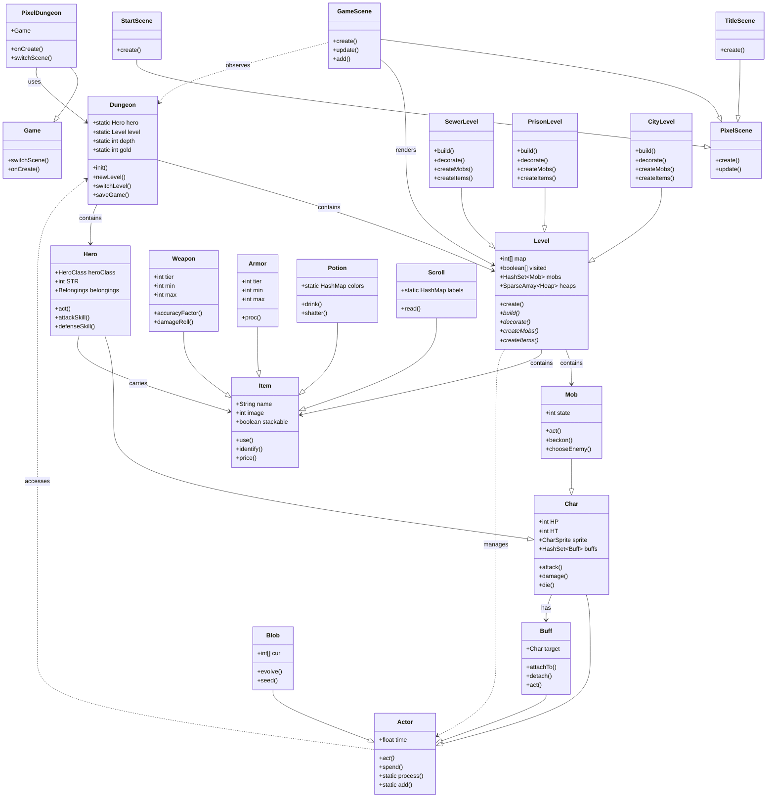

# UML 架构草图

该文档通过 UML 类图展示 Pixel Dungeon 的核心架构关系，帮助开发者快速理解各模块间的依赖与继承结构。

## 核心架构图

## 关键设计模式

### 1. 模板方法模式 (Template Method)

- **Level** 类定义了 `create()` 的统一流程
- 子类重写 `build()`, `decorate()`, `createMobs()`, `createItems()` 实现具体逻辑

### 2. 单例模式 (Singleton)

- **Dungeon** 通过静态字段维护全局游戏状态
- **Preferences**, **Statistics** 等工具类采用单例访问

### 3. 观察者模式 (Observer)

- **Actor** 时间调度系统统一管理所有实体的行为
- **GameScene** 监听游戏状态变化并更新 UI

### 4. 工厂模式 (Factory)

- **Generator** 根据深度和类别生成随机物品
- **Bestiary** 根据深度生成相应怪物

## 数据流概览

1. **PixelDungeon** 启动后切换到 **TitleScene**
2. 选择角色后通过 **StartScene** 初始化 **Hero**
3. **Dungeon.init()** 创建游戏世界，**newLevel()** 生成关卡
4. **GameScene** 进入主循环，**Actor.process()** 驱动回合制逻辑
5. **Level** 管理地图、怪物、物品的空间布局
6. **Char** 子类处理战斗、移动、状态变化
7. **Item** 子类提供装备、消耗品、任务物品功能

## 扩展指南

- **新关卡类型**：继承 `Level`，重写四个抽象方法
- **新物品类型**：继承 `Item`，实现 `use()` 等核心方法
- **新怪物类型**：继承 `Mob`，定制 `act()` 和 AI 逻辑
- **新 Buff/效果**：继承 `Buff` 或 `Blob`，加入 Actor 调度
- **新场景**：继承 `PixelScene`，在 `PixelDungeon` 中注册切换逻辑
